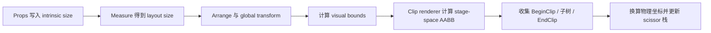

# RFC：Clip 裁剪节点

- **状态**：已接受
- **日期**：2026-07-20
- **作者**：末语项目组
- **适用范围**：`moyu`、`@momoyu-ink/kit`
- **相关实现**：`crates/nodes/src/nodes/clip.rs`、`crates/nodes/src/renderer/clip.rs`、`crates/core/src/core/render_state.rs`、`crates/core/src/utils/coordinates.rs`

## 摘要

本文定义末语 `Clip` 节点的长期语义。`Clip` 使用显式的 `width` 和 `height` 建立局部裁剪矩形，并通过 GPU scissor 限制子树绘制。裁剪区域参与节点变换、舞台边界求交和嵌套裁剪交集，也同时限制该节点子树的命中测试。

`Clip` 是矩形裁剪节点。节点经过旋转或斜切后，渲染器使用变换结果的轴对齐包围盒（AABB）作为 scissor，不提供任意旋转多边形的精确裁剪。

## 背景

末语中的普通 `Container`、`VBox` 和 `HBox` 允许子内容溢出自身布局矩形。滚动区域、固定窗口和局部交互区域需要一种显式的裁剪边界，因此引擎提供独立的 `Clip` 节点。

`Clip` 的裁剪区域不能从子树视觉边界推导。如果使用 `global_content_bounds`，超出窗口的子内容会反过来扩大裁剪范围，失去裁剪本身的意义。裁剪区域必须只来自 `Clip` 自身的布局矩形。

同时，节点位置已经包含在 `global_transform` 中。局部几何若再次从节点 `x/y` 开始，会让位移应用两次。因此所有 Clip 坐标计算都必须从局部矩形 `(0, 0, width, height)` 开始，再应用一次完整的 global transform。

## 目标

本 RFC 规定以下内容：

- `Clip` 的公开属性和布局尺寸来源；
- 局部裁剪矩形、节点变换和舞台空间 AABB 的关系；
- 舞台逻辑坐标到 surface 物理像素的换算；
- GPU scissor 的嵌套、空交集和栈恢复行为；
- 裁剪区域对命中测试和子树遍历的限制；
- Clip 与布局、视觉边界、离屏渲染和 ScrollView 的组合方式。

## 非目标

本文不定义以下能力：

- 任意旋转矩形或多边形的精确裁剪；
- 圆角、路径、遮罩纹理或 alpha mask 裁剪；
- 根据子节点自动推导裁剪尺寸；
- 自动滚动、惯性、滚动条或内容高度计算；
- 通过 Clip 隐式改变子节点布局或测量结果。

滚动行为由 `@momoyu-ink/kit` 的 `ScrollView` 和 `useScrollView` 组合实现，Clip 只负责边界与交互限制。

## 公开 API

Rust 侧注册节点类型 `clip`，Kit 侧公开 JSX intrinsic element：

```tsx
<clip width={640} height={360}>
  {children}
</clip>
```

Clip 专有属性如下：

| 属性 | 类型 | 默认值 | 说明 |
| --- | --- | --- | --- |
| `width` | `number?` | `0` | 局部裁剪矩形宽度 |
| `height` | `number?` | `0` | 局部裁剪矩形高度 |

Clip 同时支持所有通用节点属性，包括 `x/y`、anchor、pivot、scale、rotation、skew、visible、interactive、opacity 和事件监听器。

删除 `width` 或 `height` 属性后，对应尺寸恢复为 `0`。宽或高为 `0` 时，Clip 不产生可见裁剪面积，也不允许该区域中的命中继续进入子树。

## 尺寸与布局语义

`width` 和 `height` 写入节点的 intrinsic size。默认 `Node::measure()` 在测量阶段把 intrinsic size 复制到 layout size：

$$
layoutWidth=intrinsicWidth
$$

$$
layoutHeight=intrinsicHeight
$$

Clip 不根据子树内容自动测量。无论子节点是否越过边界，Clip 的 layout size 始终只由自身显式尺寸决定。

因此：

- Clip 可以作为 `VBox` 或 `HBox` 的正常直接子项；
- 父布局读取 Clip 的 layout size 作为占位尺寸；
- 子树视觉溢出不会扩大 Clip 的布局占位；
- 子节点的布局和变换不会被 Clip 修改。

Clip 在传统布局和单轴布局中的位置、anchor、pivot 与视觉变换语义遵循布局 RFC。单轴布局父节点控制 Clip 时，layout position 与用户 `x/y` 共同进入节点变换，但不会写回 Clip 的局部裁剪矩形。

## 坐标与裁剪区域

### 局部裁剪矩形

Clip 的局部裁剪矩形固定为：

$$
R_{local}=[0,width]\times[0,height]
$$

`x/y` 不属于局部矩形。它们已经参与 `NodeBase` 产生的 global transform。

### 舞台空间 AABB

设 Clip 的 global transform 为 $G$，局部矩形四角为：

$$
p_0=(0,0),\quad p_1=(width,0),\quad p_2=(0,height),\quad p_3=(width,height)
$$

对四角应用一次 global transform：

$$
q_i=G(p_i)
$$

然后取变换结果的轴对齐包围盒：

$$
minX=\min_i(q_i.x),\quad maxX=\max_i(q_i.x)
$$

$$
minY=\min_i(q_i.y),\quad maxY=\max_i(q_i.y)
$$

得到舞台逻辑坐标中的裁剪 AABB：

$$
R_{aabb}=(minX,minY,maxX-minX,maxY-minY)
$$

实现使用 `Bound::transform()` 完成四角变换和 AABB 计算。节点自身 `x/y`、layout position、父级变换、anchor、pivot、scale、rotation 和 skew 均已包含在 $G$ 中，不得在局部矩形中重复应用。

### 舞台边界求交

裁剪 AABB 与舞台逻辑矩形求交：

$$
R_{stage}=R_{aabb}\cap[0,stageWidth]\times[0,stageHeight]
$$

实现使用 `Bound::clamp()` 完成该求交。完全位于舞台外、宽高无效或求交结果为空时，使用空 `Rect` 表示零面积裁剪。

这一步只限制提交给渲染器的区域，不改变 Clip 的 layout size、global transform 或命中测试所使用的局部尺寸。

### Surface 物理坐标

RenderCommand 消费阶段将舞台逻辑矩形换算为 surface 物理像素。换算包含：

1. 舞台到 surface 的等比缩放；
2. letterbox 产生的平移；
3. 窗口 scale factor。

设等比缩放为 $s$，平移为 $(t_x,t_y)$，设备缩放因子为 $d$，则：

$$
x_{physical}=(x_{stage}s+t_x)d
$$

$$
y_{physical}=(y_{stage}s+t_y)d
$$

$$
w_{physical}=w_{stage}sd,\quad h_{physical}=h_{stage}sd
$$

最终整数物理矩形用于 WGPU scissor。

## 渲染命令与嵌套裁剪

### 命令顺序

Clip renderer 不产生自身绘制几何。它在子树绘制前后发送成对命令：

```text
BeginClip(rect)
  child commands
EndClip
```

核心渲染树遍历在进入节点时调用 `collect_commands()`，离开节点时调用 `collect_post_commands()`。一旦 Clip 开始收集命令，`BeginClip` 和 `EndClip` 必须严格成对，不能根据矩形是否为空只发送其中一个。

Clip 是否进入命令收集遵循 renderer 的通用规则：节点必须可见，并且其 `global_content_bounds` 与舞台相交。命令收集开始后，裁剪自身的具体范围仍只使用 Clip layout rect 的变换结果，不使用子树视觉边界。

### Scissor 栈

每个 `BeginClip` 将新的 scissor 压入栈。设当前 scissor 为 $S_{parent}$，新 Clip 的物理矩形为 $S_{clip}$，实际生效区域为：

$$
S_{current}=S_{parent}\cap S_{clip}
$$

因此嵌套 Clip 自动取所有祖先裁剪区域的交集。`EndClip` 弹出当前项，并恢复上一层 scissor。

栈底是当前 render target 的完整有效区域。离屏渲染切换 render target 时，会压入离屏纹理对应的 scissor，并使用离屏纹理偏移把后续 Clip 坐标转换到当前视图坐标。恢复 render target 时同步弹出该项。

### 空裁剪区域

WGPU 的 `set_scissor_rect` 不能直接使用零宽或零高。空交集在引擎内部仍以 `[x,y,0,0]` 压入栈，以保留真实裁剪状态和嵌套层级；提交给 WGPU 时临时使用合法的 `1×1` 矩形。

Draw 命令在执行前检查当前 scissor。若栈顶宽或高为 `0`，直接跳过 Draw，因此临时 `1×1` scissor 不会产生像素泄漏。

内层空 Clip 结束后必须恢复原外层 scissor。空区域不能通过跳过 `BeginClip` 或额外弹栈破坏祖先裁剪状态。

## 命中测试

Clip 实现 `Focusable`，自身命中和是否允许继续检查子树使用相同的局部边界：

$$
0\le x\le width
$$

$$
0\le y\le height
$$

命中测试先用节点 global transform 的逆矩阵，把全局逻辑坐标转换为 Clip 局部坐标，再检查上述矩形。

由此得到以下行为：

- 点击位于 Clip 局部矩形内时，可以继续命中其子节点；
- 点击位于 Clip 局部矩形外时，不继续遍历 Clip 子树；
- 子节点即使视觉上溢出 Clip，也不能在裁剪区域外被命中；
- Clip 的父级变换、layout position、anchor、pivot、scale、rotation 和 skew 会通过逆 global transform 正确参与命中；
- 宽或高为 `0` 时不命中。

渲染使用变换后 AABB scissor，而命中测试使用逆变换后的精确局部矩形。对于旋转或斜切 Clip，两者边界可能不同：AABB 内但局部矩形外的区域可能通过 GPU scissor，却不会通过 Clip 命中测试。

## 旋转与斜切限制

WGPU scissor 只能表示 surface 坐标中的轴对齐矩形。因此 Clip 经过 rotation 或 skew 后，渲染区域使用变换后四角的 AABB，而不是原旋转四边形。

这意味着：

- 未旋转、未斜切的 Clip 能精确表示矩形裁剪；
- 旋转或斜切后的 Clip 可能保留 AABB 四角的额外像素；
- scale、translation、父级变换和 pivot 仍会正确影响 AABB；
- 命中测试仍按精确局部矩形判断。

需要精确旋转形状、圆角或任意路径裁剪时，应设计独立的 stencil 或 mask 能力，不扩展现有 scissor Clip 的语义。

## 与其他系统组合

### ScrollView

Kit 的 `ScrollView` 使用 Clip 作为视口，并把可滚动内容放在内部 `animated.vbox`：

```text
Clip(width, height)
  animated VBox(y = -scrollOffset)
```

Clip 负责限制绘制和命中；`useScrollView` 负责 wheel、touch、scroll offset 和内容高度。两者职责分离。

### Filter 与 Backdrop

Filter 和 Backdrop 可以与 Clip 嵌套，但它们可能切换 render pass、捕获纹理或使用离屏 render target。无论命令之间是否出现 Barrier 或离屏阶段，当前 scissor 状态都必须由 RenderState 保存和恢复。

Clip 的自身裁剪矩形不得改为 Filter 或 Backdrop 所使用的子树 `global_content_bounds`。前者定义固定视口，后者描述需要处理的视觉范围，语义不同。

### 可见性与交互

`visible=false` 时，Clip 及其渲染子树不收集正常渲染命令。布局阶段仍会测量 Clip，是否占位遵循通用布局规则。

`interactive` 控制节点是否参与通用命中遍历，默认值为 `true`。需要由 Clip 限制子树命中时，Clip 必须保持可交互；若显式设置 `interactive=false`，命中遍历会跳过 Clip 及其子树。Kit 的 ScrollView 会在 Clip 上注册 wheel 和 touch 事件，并依赖 Clip 参与交互树。

## 生命周期

Clip 遵循统一的三阶段布局与渲染生命周期：



同一帧内修改 Clip 尺寸或变换后，renderer 使用本帧最终 layout size 和 global transform 计算裁剪区域，不依赖上一帧坐标。

## 错误与边界行为

- `width` 或 `height` 缺失时按 `0` 处理；
- layout width 或 height 小于等于 `0` 时产生空裁剪区域；
- 完全位于舞台外时产生空裁剪区域；
- 部分越过舞台时裁剪到舞台边界；
- 嵌套 Clip 无交集时，内部 Draw 全部跳过；
- Clip 结束后恢复父级 scissor；
- 子树视觉溢出不会扩大 Clip；
- 旋转和斜切使用 AABB，不保证形状级精确裁剪。

## 性能

Clip 使用 GPU scissor，不新增纹理、渲染管线或片元遮罩。每个 Clip 的主要 CPU 成本为：

- 四个局部矩形角的 global transform；
- 一次舞台边界求交；
- 一次逻辑坐标到物理像素换算；
- 一次 scissor 栈 push 和 pop；
- 对每个 Draw 检查当前 scissor 是否为空。

空 scissor 下的 Draw 会在绑定 pipeline、bind group 和 vertex buffer 前跳过，避免无效 GPU 工作。深度嵌套会线性增加 scissor 栈操作，但不增加额外绘制 pass。

## 测试与验收

最低自动测试应覆盖：

1. **坐标**：节点 `x/y` 只应用一次，父级 transform 与 layout position 正确组合；
2. **变换**：pivot、rotation、scale 和 skew 得到正确舞台空间 AABB；
3. **舞台边界**：部分越界正确求交，完全越界得到空矩形；
4. **嵌套栈**：内层 Clip 取父级交集，空内层弹出后恢复外层 scissor；
5. **空区域**：零尺寸或空交集不产生 `1×1` 像素泄漏。

运行时验收至少包括：

- 普通未变换 Clip；
- 带父级位移和自身位移的 Clip；
- VBox/HBox 中的 Clip；
- 嵌套 Clip；
- 完全和部分越过舞台的 Clip；
- ScrollView 滚动内容及边界外命中；
- 含 Filter 或 Backdrop 的 Clip 子树。

当前自动验证命令包括：

```bash
cargo test -p moyu_core --features js_runtime utils::coordinates::tests
cargo test -p moyu_core --features js_runtime core::render_state::tests
cargo build
```

## 被否决的方案

### 使用节点 `x/y` 作为局部矩形起点

`global_transform` 已包含 `x/y`。局部矩形再次从 `(x,y)` 开始会重复应用位移，在父级变换和单轴布局中也会继续累积错误。局部几何必须从 `(0,0)` 开始。

### 使用子树 global content bounds

子树视觉边界包含溢出内容。用它作为 Clip 范围会让被裁剪内容反过来扩大视口，因此只能使用 Clip 自身 layout rect。

### 空区域不发送 BeginClip

若跳过 `BeginClip` 却仍发送 `EndClip`，会错误弹出外层 scissor。若同时跳过两者，还需要让命令遍历跳过整个子树，增加条件分支并破坏统一的 enter/leave 命令模型。保留成对命令和空 scissor 状态更直接可靠。

### 将零尺寸 scissor 强制为 1×1 后继续绘制

该方案满足 WGPU 参数约束，但会泄漏一个像素。引擎应保留真实的零尺寸栈状态，并在 Draw 前跳过绘制。

### 用 scissor 实现精确旋转裁剪

Scissor 只能表示轴对齐矩形，无法表达旋转四边形。通过 AABB 明确降级，保持实现简单和高效；精确形状裁剪应使用独立的 stencil 或 mask 设计。

## 后续工作

以下事项需要独立 RFC 或迭代：

- stencil 或 mask 形式的精确形状裁剪；
- 圆角矩形和路径裁剪；
- Clip、Filter、Backdrop 与复杂离屏嵌套的专项集成测试；
- 对物理像素取整策略进行高 DPI 边缘测试；
- 在调试工具中显示局部 layout rect、舞台 AABB 和最终 scissor。

## 结论

Clip 使用自身显式 layout rect 定义固定视口：

- 局部矩形始终从 `(0,0)` 开始；
- 完整 global transform 只应用一次；
- 变换后计算舞台空间 AABB，再与舞台边界求交；
- GPU 侧通过可嵌套 scissor 栈限制绘制；
- 空裁剪保持栈平衡并跳过 Draw；
- 命中测试通过逆 global transform 检查精确局部矩形；
- 子树视觉溢出不改变 Clip 的尺寸或裁剪区域。

本文所定义的语义是后续 ScrollView、复杂 UI 视口和新裁剪能力的兼容性基准。
