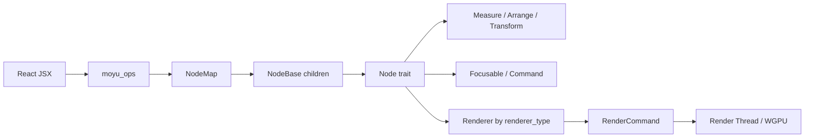
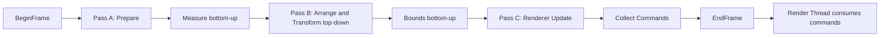

# RFC：末语基础节点系统

- **状态**：已接受
- **日期**：2026-07-20
- **作者**：末语项目组
- **适用范围**：`moyu_core`、`moyu_ops`、`@momoyu-ink/kit`
- **相关 RFC**：[布局系统](./2026-07-20-layout-system.md)、[Clip](./2026-07-20-clip.md)
- **相关实现**：`crates/core/src/nodes/`、`crates/core/src/traits/`、`crates/core/src/core/render.rs`、`crates/core/src/utils/`、`crates/ops/src/node.rs`

## 摘要

本文定义末语基础节点系统的职责和长期语义。基础节点系统由以下部分组成：

1. `NodeBase` 保存所有节点共享的身份、树结构、布局、变换、视觉、输入和更新状态；
2. `Node` trait 定义节点类型的创建、布局和可选能力扩展点；
3. `Renderer` trait 负责准备渲染内容、更新 GPU 资源并生成渲染命令；
4. `Container` 作为不直接绘制内容的基础树节点，负责分组和内容尺寸测量；
5. `NodeLock` 和 `NodeMap` 负责跨系统共享节点实例，children 负责表达逻辑树；
6. Core 通过分阶段遍历完成测量、排列、变换、边界、绘制命令收集和输入命中。

节点描述场景中的结构与状态，Renderer 描述某类节点如何产生 GPU 工作。二者按类型关联，但生命周期和实例数量不同：每个节点都有独立实例，同一种 Renderer 通常由该类型的所有节点共享。

## 背景

末语使用 React 自定义 reconciler 构建节点树。JS 侧创建 JSX 元素后，通过 `moyu_ops` 调用 Rust 创建节点、更新属性和修改 children；Rust Core 负责布局、变换、命中和渲染。

节点体系需要同时满足以下需求：

- 普通分组节点不必拥有 GPU renderer；
- 图片、文本、滤镜等节点可以提供不同的渲染实现；
- 布局容器和 wrapper 节点可以改写测量、排列或子树渲染行为；
- native 与 web 使用同一套节点、布局和事件语义；
- React 的原始 children 顺序与绘制层级可以分离；
- 更新线程只生成渲染命令，渲染线程按顺序消费命令。

因此，基础状态、节点行为、GPU 渲染和 JS bridge 必须保持清晰边界。

## 目标

本文规定：

- 节点身份、所有权和树结构；
- `NodeBase`、`NodeBaseTrait`、`Node` 和 `Renderer` 的职责；
- 通用属性的增量更新语义；
- 节点创建、挂接、每帧更新和销毁生命周期；
- 布局、变换、视觉边界与渲染命令之间的关系；
- children 原始顺序、`zIndex` 绘制顺序和命中顺序；
- `Container` 的基础行为；
- Focusable、Command、事件和渲染 shadow 等可选能力；
- 锁、失效传播和扩展节点时必须遵守的不变量。

## 非目标

本文不定义：

- Sprite、Text、Video、Shader、Filter、Backdrop 等具体复杂节点的属性和 renderer 细节；
- 完整的布局算法，相关语义由布局系统 RFC 定义；
- 具体 RenderCommand 的 GPU 编码细节；
- React reconciler 的 Fiber、提交阶段或事件 prop 注册实现；
- 资源管理、纹理缓存、字体排版、音视频解码；
- CSS stacking context、DOM 事件模型或完整无障碍树；
- 未来的 ECS、场景序列化或编辑器调试协议。

## 术语

### 节点实例

实现 `Node` trait 的 Rust 实例。每个正常运行时节点拥有唯一 ID 和一份 `NodeBase`。

### 节点类型

由 `Node::node_type()` 标识的节点行为类型。创建节点时使用的 factory 注册名、`node_type()` 和 `renderer_type()` 具有不同职责，不要求字符串始终相同。

### 逻辑树

由父节点 `NodeBase.children` 保存的有序节点关系。布局、变换和视觉边界使用逻辑树遍历。

### 绘制树

从逻辑树派生的渲染遍历视图。它遵守 `zIndex`、`visible` 和渲染 shadow，但不物理修改原始 children。

### 节点能力

节点按需暴露的附加接口，例如 `Focusable` 和 `Command`。未实现能力的节点返回 `None`，Core 不需要为每种节点建立独立分支。

## 总体架构



### 数据与行为分离

- `NodeBase` 保存所有节点共有的数据和通用操作；
- 具体节点结构体保存自身专属数据；
- `Node` trait 决定该节点如何创建、测量、排列及暴露可选能力；
- `Renderer` 保存某一渲染类型共享的 GPU pipeline、layout 和缓存，并处理该类型的所有节点实例；
- Core 负责统一遍历和生命周期调度，不直接识别具体复杂节点。

## 节点身份与所有权

### NodeLock

运行时通过以下类型共享节点：

```rust
pub type NodeLock = Arc<RwLock<Box<dyn Node>>>;
```

- `Arc` 允许 NodeMap、父节点 children 和临时调用者共同持有实例；
- `RwLock` 允许只读查询与属性、布局、GPU 状态更新互斥；
- `Box<dyn Node>` 允许不同节点类型保存在同一棵树中。

锁只用于保护节点实例，不表达父子关系。持锁范围应尽可能短，尤其不得在持有节点锁时同步触发可能重入节点系统的用户事件。

### NodeMap

`NodeMap` 是节点 ID 到 `NodeLock` 的全局索引，用于 bridge、事件和命令按 ID 查找节点。它不是场景树：

- 节点存在于 NodeMap，不代表已挂入逻辑树；
- 从父节点 children 移除，不代表节点已从 NodeMap 销毁；
- 从 NodeMap 移除后，只要仍有 `Arc` 引用，实例就不会立即析构。

### 节点 ID

正常运行时节点必须通过 `NodeBase::new(label)` 创建并获得 ID。根节点固定使用 ID `0`，普通节点使用后续 ID。

ID 在进程内标识节点实例，不是持久化 ID，也不应跨引擎会话复用。当前实现使用全局递增计数分配 ID；其线程安全和溢出处理属于后续基础设施改进，不构成对外 API 保证。

### 逻辑树

父子关系只保存在：

```rust
NodeBase.children: Vec<NodeLock>
```

原始 Vec 顺序具有以下语义：

- 对应 React / JSX children 顺序；
- 用于布局测量和排列；
- 当兄弟节点 `zIndex` 相同时决定绘制顺序；
- 不应为了绘制排序而物理重排。

当前实现没有父指针，也不在 Core 层自动执行 reparent、去重或环检测。正常调用方必须保证节点树无环，并在把节点加入新父节点前从旧父节点移除。是否在 bridge 增加结构校验属于后续独立改进。

## NodeBase

`NodeBase` 是每个节点共享的运行时状态，不代表完整节点行为。

### 状态分类

| 分类 | 主要字段 | 职责 |
| --- | --- | --- |
| 身份 | `id`、`label` | 查找、调试和事件目标 |
| 树 | `children` | 保存逻辑子节点及原始顺序 |
| 尺寸 | intrinsic size、layout size | 内容自然尺寸与最终布局尺寸 |
| 定位 | `translate`、`anchor`、`pivot`、layout position | 手动定位和父布局分配位置 |
| 变换 | scale、rotation、skew、local/global transform | 计算节点和子树的空间关系 |
| 视觉 | `visible`、tint、opacity、global opacity | 通用视觉状态及继承结果 |
| 输入 | `interactive`、cursor | 是否允许子树参与命中及光标表现 |
| 层级 | `zIndex` | 同父直接子节点的绘制和命中顺序 |
| 边界 | content bounds、global content bounds | 节点及子树的视觉 AABB |
| 失效 | update ID、prepare 和 vertex 标记 | 控制变换传播与 renderer 更新 |

intrinsic size、layout size、layout position 和 content bounds 的精确定义见布局系统 RFC。

### 通用属性

`NodeProps` 是通用属性的 Rust/JS schema，并通过 `ts-rs` 导出给 `@momoyu-ink/kit`。字段使用 `Patch<T>`：

| Patch 状态 | JS 含义 | 行为 |
| --- | --- | --- |
| `Missing` | 本次更新没有该字段 | 保持现值 |
| `Set(value)` | 提供新值 | 写入新值 |
| `Reset` | 属性被删除或传入重置值 | 恢复默认值 |

创建和后续 `update_props` 都必须先调用 `NodeBase::update_properties()`，再调用具体节点的 `Node::update_properties()`。具体节点不应重复解析通用属性。

### 更新失效

影响布局、变换、视觉或绘制层级的 setter 应增加节点 update ID。`NodeBase::update()` 检测到变化后：

1. 重新计算 local transform；
2. 与父 global transform 合成；
3. 重新计算 global opacity；
4. 标记顶点需要更新；
5. 让直接子节点进入待更新状态。

最后一步保证父变换或透明度改变时，后代能够刷新 global transform 和继承状态。专属节点若改变 intrinsic size，应通过 `set_intrinsic_size()` 等入口触发布局和变换失效。

## NodeBaseTrait

具体节点通过组合而不是继承复用 `NodeBase`。节点结构体包含一个 `NodeBase` 字段，并通常使用 `#[derive(Node)]` 与 `#[base]` 自动实现 `NodeBaseTrait`。

`NodeBaseTrait` 提供：

- `base()` / `base_mut()`：访问共享状态；
- `as_any()` / `as_any_mut()`：在明确知道具体类型时进行 downcast。

Core 的通用逻辑应优先依赖 `Node` 和 `NodeBaseTrait`，避免按具体节点类型分支。Downcast 主要留给对应 Renderer 或确有类型关联的专属路径。

## Node trait

所有运行时节点实现：

```rust
pub trait Node: NodeBaseTrait + Debug + Send + Sync
```

### 创建与类型

- `create_instance(label)`：由已注册 factory 创建具体节点；
- `node_type()`：返回节点行为类型标识；
- `renderer_type()`：返回 Renderer 查找键，默认等于 `node_type()`；
- `into_node_lock()`：把具体节点包装为 `NodeLock`。

factory 注册名用于 JS 创建节点，`node_type()` 用于节点自识别，`renderer_type()` 用于 Renderer 查找。三者可相同，但不能在架构上视为同一概念。例如 Container 的 factory 名是 `container`，而其 `node_type()` 是 `node`，且不需要 Renderer。

### 属性与布局 hook

- `update_properties()`：处理专属增量属性；
- `measure()`：根据当前内容和子节点确定 layout size，默认使用 intrinsic size；
- `arrange()`：为直接子节点分配 layout position，默认清除父布局控制；
- `pre_update(parent)`：在通用 transform 更新前同步父驱动状态；
- `participates_in_parent_measure()`：决定节点是否作为父级自动测量项目。

复杂节点应通过这些 hook 接入统一生命周期，而不是绕过 Core 另建 JS 布局或独立树遍历。

### 子树渲染控制

`shadowed(ShadowKind::Rendering)` 表示节点接管了直接子树的普通绘制。返回 `true` 时，绘制遍历不会进入 children，但逻辑树的 prepare、measure、arrange、transform 和 bounds 仍然执行。

`ready()` 和 `children_ready()` 用于需要确认整棵子树准备完成的 retained rendering 场景。递归检查可能有成本，不应在无需要时频繁调用。

### 可选能力

- `as_focusable()`：节点实现 `Focusable` 后返回自身；
- `as_command()`：节点实现 `Command` 后返回自身。

能力查询保持 Core 与具体节点解耦。未实现相应能力的节点返回 `None`。

## Renderer trait

Renderer 是节点类型级别的 GPU 资源与渲染命令生产者。它不是节点组件，也不保存逻辑树。

### 类型与共享

Core 按 `renderer_type()` 在 renderer registry 中查找 Renderer。通常一种 Renderer 实例服务多个同类型节点，因此：

- 节点实例状态应保存在具体 Node 或按 node ID 索引的 renderer 缓存中；
- Renderer 中的共享 pipeline、bind group layout 和通用资源应按类型复用；
- Renderer 不应依赖当前调用节点之外的隐式“活跃节点”状态。

### 生命周期接口

| 接口 | 调用阶段 | 职责 |
| --- | --- | --- |
| `prepare()` | Pass A，measure 之前 | 准备会影响 intrinsic size 的内容或资源 |
| `update()` | Pass C，命令收集之前 | 更新 GPU buffer、纹理、顶点和实例资源 |
| `should_collect_commands()` | Pass C | 判断节点是否需要产生绘制命令 |
| `collect_commands()` | Pass C 进入节点 | 生成节点或子树开始前的命令 |
| `collect_post_commands()` | Pass C 离开节点 | 生成子树结束后的收尾命令 |

默认 `should_collect_commands()` 要求节点可见，并且 global content bounds 与舞台相交。特殊 Renderer 可以覆盖该判断，但必须自行保证裁剪和命令配对正确。

`collect_commands()` 与 `collect_post_commands()` 组成节点子树的进入/离开边界。Clip、离屏 pass 等结构依赖命令范围连续，因此不能在命令收集完成后对单条 Draw 命令做全局层级排序。

`begin()` / `finish()` 当前保留在 trait 中，但不属于现役 Core 帧生命周期，本文不赋予其每帧调用保证。

## Container

Container 是基础分组节点：

- 保存 `NodeBase` 和 children；
- 自身不产生 Draw 命令；
- 不自动排列子节点；
- 使用传统 `x/y`、anchor、pivot 和视觉变换；
- 根据参与父级测量的直接子节点计算 layout size；
- 可以作为 JSX 组件边界、覆盖内容分组或布局容器中的复合项目。

Container 测量直接子节点的未变换布局矩形，计入子节点 `x/y`、pivot 和 layout size，不计入 anchor、scale、rotation 或 skew。精确公式和负坐标语义见布局系统 RFC。

根节点也是 Container，但具有特殊生命周期：

- ID 固定为 `0`；
- layout size 每帧直接设为舞台逻辑尺寸；
- 不执行普通 Container 的内容包裹 measure；
- 它为顶层 anchor、布局和全局变换提供稳定基准。

## 创建、属性更新与树操作

### 创建

JS 创建节点时：

1. bridge 根据 factory 注册名创建 `Box<dyn Node>`；
2. 节点通过 `NodeBase::new()` 获得 ID；
3. bridge 包装为 `NodeLock` 并插入 NodeMap；
4. 应用通用 NodeProps；
5. 应用具体节点 Props；
6. 返回节点 ID。

创建实例不会自动挂入逻辑树。React reconciler 随后通过 children 操作把节点连接到父节点。

### 树操作

bridge 提供 add、insert、insert-before、remove 和 remove-at 操作。操作只修改父节点的 children Vec，不修改 NodeMap，也不隐式销毁节点。

调用方必须保证：

- 插入索引有效；
- 被移除节点确实属于该父节点；
- 参照节点属于当前父节点；
- 不产生重复父子边或环；
- reparent 时先解除旧父关系。

当前部分 bridge 路径对无效 remove 使用 `unwrap()`，insert-before 找不到参照节点时会插入开头。这些是现有错误处理限制，不是推荐调用语义，后续应统一转换为明确的 `Result`。

### 属性更新

`update_props` 在同一个节点写锁内依次应用通用和专属 Patch。属性更新只修改节点状态；最终 layout、transform、bounds 和 GPU 资源在下一次 `Graphics::update()` 中统一收敛。

## 每帧生命周期



### Pass A：Prepare 与 Measure

使用完整逻辑树的原始 children 顺序：

- 进入节点时，根据 `renderer_type()` 调用 Renderer `prepare()`；
- 离开节点时调用 Node `measure()`；
- 子节点先测量，父节点再读取最终子尺寸。

该阶段不因 `visible=false` 或渲染 shadow 跳过节点。

### Pass B：Arrange、Transform 与 Bounds

1. 根节点先执行 `arrange()`；
2. 进入子节点时依次执行 `pre_update(parent)`、`NodeBase::update(parent)` 和 `arrange()`；
3. 离开子节点时计算 content bounds；
4. 最后计算根节点 bounds。

排列和变换自顶向下，视觉边界自底向上。父布局与父变换必须先于后代生效。

### Pass C：Renderer Update 与命令收集

使用绘制树遍历：

- 兄弟节点按 `zIndex` 稳定升序；
- 不可见节点不进入正常渲染子树；
- 渲染 shadow 节点不继续遍历 children；
- 进入节点时执行 `update()`、可见性判断和 `collect_commands()`；
- 离开节点时执行配对的 `collect_post_commands()`。

更新线程发送 `RenderCommand`，渲染线程按命令顺序编码和提交 WGPU 工作。节点树与 WGPU render pass 不直接共享可变节点引用。

## 绘制顺序与 zIndex

每个父节点从原始 children 临时派生稳定绘制顺序：

1. 按直接子节点 `zIndex` 从小到大排序；
2. 相同值保持原始 children 顺序；
3. 每个直接子节点连同整棵子树作为连续绘制单元；
4. 排序不修改 children，不影响布局、focus 顺序或 React reconciliation。

这不是 CSS stacking context。后代只能在父节点子树内部排序，不能通过更大的 `zIndex` 越过父节点的兄弟节点。

## 命中与输入

### Focusable

节点实现 `Focusable` 并通过 `as_focusable()` 暴露后，才能作为具体命中目标。

命中测试从父空间位置开始，把指针位置通过节点 inverse global transform 转换到节点局部空间，再调用：

- `contains(x, y, payload)`：判断节点自身是否命中；
- `contains_children(x, y, payload)`：判断该位置是否需要继续检查后代。

默认 `contains()` 使用节点 content bounds。非矩形或具有专属交互范围的节点应覆盖该方法。

### 顺序与子树开关

命中按照绘制顺序的逆序遍历兄弟节点，因此视觉最靠前的节点优先：

- `zIndex` 大的节点优先；
- 相同 `zIndex` 时，原始 children 中靠后的节点优先；
- `interactive=false` 会跳过节点及其整棵输入子树。

鼠标、触摸和滚轮共享这套目标选择顺序。命中目标确定后，事件系统再处理 hover、按下、释放和对应的节点事件派发。

当前命中遍历不检查 `visible`，因此不可见但 interactive 的节点仍可能成为目标。这是现有实现限制，不应被依赖；后续应独立统一可见性与输入语义。

## 事件与命令

### 节点事件

Core 在确定目标和更新内部 pointer 状态后，将事件发送给 JS 侧。触发可能引起 JS 回调重入的事件前，必须释放节点读写锁，避免回调再次访问同一节点时死锁。

节点若需要发送专属事件，应使用现有 `NodeEventSource` / 事件派发机制，不建立独立的全局回调系统。

### 节点命令

需要命令式控制的节点实现 `Command`，并通过 `as_command()` 暴露。bridge 按 ID 查找节点、获得写锁后调用命令接口。普通属性变化仍应优先使用 Props；Command 用于播放、跳转、快照等具有动作语义的操作。

### 析构事件

节点实例真正析构时，`NodeBase::drop()` 发送现有 `NodeEvent::Destory`。该 symbol 的拼写是当前绑定的一部分，其含义为节点销毁事件。

从 NodeMap 移除不等于立即析构：children、临时引用或其他持有者释放最后一个 `Arc` 后才会触发 Drop。

## 销毁

`destroy_instance()` 尝试从 NodeMap 移除节点，并递归处理 children。当前实现使用 `Arc::strong_count()` 判断节点是否仍被其他位置持有；引用数超过预期时会跳过销毁。

因此调用方应先完成 React 树解绑，再销毁不再使用的节点。销毁流程不应被当作强制打断所有引用的资源回收机制。

长期上，节点销毁应具备明确的所有权协议，避免把具体引用计数阈值作为行为依据；该改进不在本文范围内。

## 渲染与逻辑树不变量

实现和扩展节点时必须保持：

1. 原始 children 是布局和 React 顺序的唯一来源；
2. `zIndex` 只派生绘制与命中顺序，不物理重排 children；
3. 节点子树的进入/离开渲染命令必须连续且正确配对；
4. prepare 中产生的 intrinsic size 必须在同帧 measure 中可见；
5. 父 arrange 和 transform 必须先于后代 transform；
6. content bounds 必须在子节点 bounds 完成后聚合；
7. 渲染 shadow 只接管 Pass C，不跳过逻辑布局生命周期；
8. 属性更新先通用后专属；
9. 用户事件派发前释放可能导致重入死锁的节点锁；
10. Renderer 不得在 Pass C 首次决定本帧布局尺寸。

## 扩展基础节点

新增节点时，按以下顺序判断所需能力：

1. 结构体包含 `NodeBase`，使用 `#[derive(Node)]`；
2. 实现 `Node::create_instance()` 和 `node_type()`；
3. 有专属属性时实现 `update_properties()`；
4. 有特殊尺寸或子项排列时实现 `measure()` / `arrange()` / `pre_update()`；
5. 有 GPU 内容时注册 Renderer，并通过 `renderer_type()` 关联；
6. 需要输入或命令时分别实现 `Focusable` / `Command`；
7. 需要接管子树绘制时实现 `shadowed(Rendering)`；
8. 涉及 JS/Rust Props 时生成 TypeScript bindings。

不直接绘制内容的结构节点不需要空 Renderer。若只是分组和自动内容尺寸，应优先复用 Container 或在其语义上扩展。

## 错误处理与当前限制

### 规范要求

- JS bridge 查找不到 node ID 时返回明确错误；
- 属性反序列化失败时记录节点类型和字段上下文；
- 树操作非法时返回 `Result`，不 panic；
- Renderer 缺失时结构节点可以继续参与逻辑生命周期，有渲染要求的节点应记录可诊断错误；
- 节点树必须保持无环；
- 生命周期事件和命令不得在持锁状态下造成同步重入死锁。

### 当前实现限制

以下事项描述现状，但不作为长期承诺：

- Node ID 使用 `static mut u32` 递增；
- Core 不保存父指针，也不检查重复挂接或环；
- 部分 remove bridge 路径对无效操作使用 `unwrap()`；
- insert-before 找不到参照节点时插入索引 `0`；
- 销毁依赖具体 `Arc::strong_count()` 阈值；
- `visible=false` 不会自动排除命中；
- `Renderer::begin()` / `finish()` 存在但未接入现役帧生命周期。

这些问题应分别通过小型迭代修复，不在基础 RFC 中扩大为复杂所有权或调度重构。

## 测试与验收

基础节点系统至少覆盖：

1. **身份与属性**：ID 唯一、通用 Patch 的 Missing/Set/Reset、通用属性先于专属属性；
2. **树操作**：add、insert、remove、reorder、reparent 及非法输入错误；
3. **布局与变换**：父变换失效传播、anchor/pivot、layout position 与 content bounds；
4. **绘制与命中**：负/正 `zIndex`、相同值稳定顺序、整棵子树连续、逆序命中；
5. **生命周期**：prepare/measure/arrange/update/command collection 顺序、shadow、可见性和销毁事件。

最低工程验证包括：

- `cargo build`；
- NodeProps bindings 导出；
- `@momoyu-ink/kit` 构建；
- 至少一个 framework 类型检查和生产构建。

## 被否决的方案

### NodeBase 直接成为所有节点的继承基类

Rust 不使用类继承。组合 `NodeBase` 并通过 trait 暴露共享状态，能保持数据布局明确，也允许 derive macro 减少样板代码。

### 每个节点实例拥有独立 Renderer

Pipeline 和 bind group layout 等 GPU 状态适合按类型共享。每实例 Renderer 会增加资源重复、注册复杂度和跨线程状态管理成本。

### 使用 NodeMap 表达场景树

NodeMap 适合按 ID 查找，不保存 children 顺序，也不能表达子树连续绘制。逻辑树必须由父节点的有序 children 表达。

### 直接重排 children 实现 zIndex

物理重排会改变 React 顺序、VBox/HBox 布局和相同层级的稳定语义。绘制顺序必须从原始 children 派生。

### 收集完成后全局排序 Draw 命令

Clip、离屏 pass 和其他 wrapper 依赖进入/离开命令包围完整子树。全局排序单条 Draw 会破坏命令配对，因此必须在遍历直接子节点时按子树排序。

### 把布局放到 Renderer update

Renderer update 发生在布局和 transform 之后。此时首次改变尺寸会导致父布局下一帧才收敛。影响尺寸的工作必须在 prepare 完成，并由 measure 在同一帧消费。

## 后续工作

以下事项需要独立迭代或 RFC：

- 统一 `visible` 与输入命中的关系；
- 为树操作增加 reparent、重复挂接和环检测；
- 把无效 remove / insert 转换为稳定的 `Result`；
- 用线程安全且具有溢出策略的节点 ID 分配器替代 `static mut`；
- 明确销毁所有权协议，移除对引用计数阈值的隐式依赖；
- 评估并清理未接入生命周期的 Renderer `begin()` / `finish()`；
- 基于 profile 决定是否缓存 paint order 或引入更细粒度 dirty propagation。

## 结论

末语基础节点系统采用“共享基础状态 + 节点行为 trait + 类型级 Renderer + 有序逻辑树”的结构：

- `NodeBase` 统一身份、树、布局、变换、视觉、输入和失效状态；
- `Node` 通过小型 hook 扩展测量、排列、渲染接管和可选能力；
- `Renderer` 在统一帧生命周期中准备内容、更新 GPU 资源并生成命令；
- `Container` 提供不绘制内容的基础分组和内容测量；
- 原始 children 保持 React 与布局顺序，`zIndex` 派生绘制与命中顺序；
- 三阶段更新保证当前帧尺寸、变换、边界和渲染命令一致。

本文是后续新增节点、调整 Core 遍历、扩展 Renderer 和修正节点所有权问题时的基础约束。
