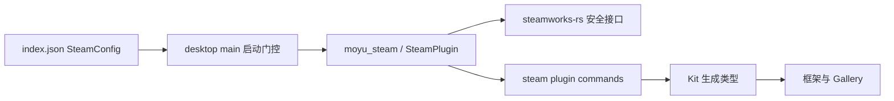
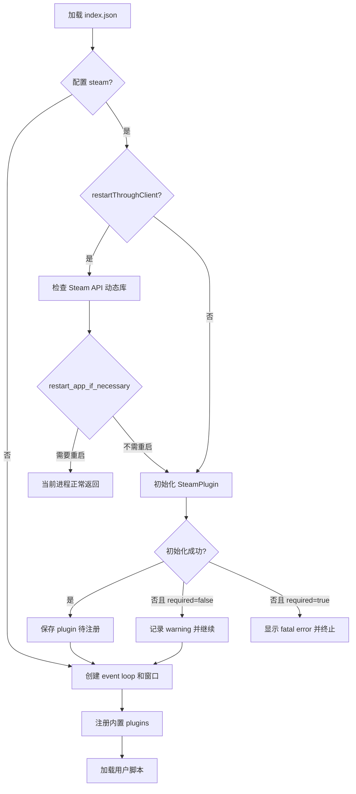

# RFC：Steam 桌面端集成

- **状态**：已接受
- **日期**：2026-07-22
- **作者**：末语项目组
- **适用范围**：`moyu`、`moyu_steam`、`moyu_pal`、`@momoyu-ink/kit`、`@momoyu-ink/gallery`、末语使用的 `steamworks-dynamic-rs`
- **相关实现**：`crates/steam/`、`crates/platform/src/config.rs`、`crates/moyu/src/main.rs`、`crates/moyu/src/entry.rs`、`packages/kit/src/commands.ts`、`packages/gallery/src/pages/steam.tsx`

## 摘要

本文定义末语对 Steam 的首轮桌面端集成规范。Steam 作为独立的 `steam` plugin 接入引擎，通过项目配置决定是否启用、初始化失败时是否终止启动，以及是否要求从 Steam Client 重启应用。Steam 可用时，JavaScript 通过类型化 plugin commands 使用 Achievement、Apps、Overlay、Stats、Timeline、User 和 Workshop 查询能力。

Steam 初始化、API 调用和 callback pump 均在末语主线程完成。Steam API 动态库缺失或客户端初始化失败时，可选集成会跳过 plugin 注册并继续启动；必需集成会在窗口和用户脚本创建前终止。Web 和移动端不编入 Steam FFI。

Achievement 和 Stats 以 Steam Client 为唯一数据来源，使用 Steam 的本地缓存和同步机制。末语不维护第二份本地缓存。

## 背景

末语项目需要在不破坏非 Steam 发行渠道和非桌面平台的前提下使用 Steamworks。该能力同时涉及以下边界：

- Steam API 动态库必须在窗口和图形初始化前加载；
- 某些项目依赖 Steam 身份与服务，另一些项目只把 Steam 作为可选增强；
- Steam callbacks 需要持续由引擎主循环驱动；
- JavaScript 不能直接接触 Steamworks raw bindings；
- Steam ID、Workshop item ID 和文件大小可能超过 JavaScript 安全整数范围；
- Kit 需要从 Rust 定义生成准确的 command 类型；
- Web、Android 和 iOS 构建不得链接 Steamworks FFI。

因此 Steam 不能实现为普通用户脚本库，也不能在窗口创建后延迟初始化。它需要同时进入平台配置、桌面启动链、引擎 plugin 生命周期和 Kit 类型出口。

## 目标

本 RFC 规定以下内容：

- Steam 项目配置与桌面启动门控；
- Steam 初始化失败时的可降级和必需两种策略；
- `SteamPlugin` 的注册、所有权和 callback 生命周期；
- `steam` plugin command 的命名、类型、返回值和错误语义；
- 高层 Achievement 与底层 Steamworks commands 的职责边界；
- Rust、Kit、Gallery 与 `steamworks-dynamic-rs` 的依赖关系；
- 桌面平台、动态库和验证边界。

## 非目标

本文不定义以下能力：

- CLI `download`、`run` 或 `pack` 自动分发 Steam API 动态库；
- SteamPipe、Depot、安装器、商店发布、macOS 签名或公证；
- Leaderboard、Remote Storage、Steam Cloud、Rich Presence、Steam Input；
- Lobby、Networking、Game Server 或 authentication session ticket；
- Workshop 内容创建、上传、订阅和下载管理；
- 自动从剧情、页面或存档状态生成 Steam Timeline；
- Web、Android 或 iOS 的 Steam 实现；
- 直接向 JavaScript 暴露 `steamworks-sys` 或其它 raw FFI。

上述能力需要独立 RFC 或迭代。

## 总体架构

Steam 支持分为五层：



各层职责如下：

1. `moyu_pal` 反序列化 Steam 配置，不直接依赖 Steamworks。
2. `moyu` 桌面入口在创建 event loop 和窗口前执行 restart gate 与 client 初始化。
3. `moyu_steam` 持有 `steamworks::Client`，实现 plugin command 和 callback pump。
4. 末语使用的 `steamworks-dynamic-rs` 提供安全高层接口，不把 sys 类型泄漏到引擎。
5. Rust command 类型由 `ts-rs` 生成，并从 `@momoyu-ink/kit` 公开。

`moyu_steam` 只参与 Windows、Linux 和 macOS 构建。Cargo manifest 使用原生 target 条件声明依赖；`desktop` cfg alias 只用于 Rust 源码，不能用于 Cargo target dependency 条件。

当前通过 Git 使用 `DeepSpaceMill/steamworks-dynamic-rs` fork，具体解析 revision 由 `Cargo.lock` 固定。

## 项目配置

`MoyuConfig` 提供可选的 `steam` 字段：

```json
{
  "steam": {
    "appId": 480,
    "required": false,
    "restartThroughClient": false
  }
}
```

配置字段如下：

| 字段                   | 类型         | 当前默认值 | 语义                        |
| ---------------------- | ------------ | ---------- | --------------------------- | --------------------- |
| `steam`                | `SteamConfig | null`      | `null`                      | 是否启用 Steam 初始化 |
| `appId`                | `u32`        | `0`        | 传给 Steamworks 的应用 ID   |
| `required`             | `boolean`    | `false`    | 初始化失败时是否终止启动    |
| `restartThroughClient` | `boolean`    | `false`    | 是否执行 Steam restart gate |

配置使用 camelCase JSON 字段。未配置 `steam` 时，引擎不加载 Steam 动态库、不执行 restart gate，也不注册 `steam` plugin。

有效的 Steam 项目必须显式提供非零 `appId`。当前反序列化实现会接受缺省值 `0`，因此配置校验尚未完整落实；这属于已知实现限制，不应把 App ID 0 当作受支持配置。

`steam_appid.txt` 可以用于本地手工验证，但不是末语配置来源，也不是发布时替代 `appId` 的机制。

## 启动门控与初始化

Steam 初始化只发生在 desktop `main`，顺序固定为：



### 动态库预检

调用 `restart_app_if_necessary` 或 `Client::init_app` 前必须先调用 `steam_api_exists()`。动态库缺失时不得进入可能依赖已加载 FFI 的 Steamworks 路径。

`restartThroughClient=true` 时：

- Steam 要求重启：当前进程直接返回，由 Steam Client 重新启动应用；
- 动态库缺失且 `required=false`：记录 warning，随后仍尝试常规 plugin 初始化；初始化会再次预检并降级；
- 动态库缺失且 `required=true`：在创建窗口前终止。

plugin 初始化始终执行独立动态库预检，不依赖是否启用了 restart gate。

### 初始化失败策略

`required=false` 时，动态库缺失、Steam Client 不可用或 `Client::init_app` 失败都会产生 warning。引擎继续启动，但不注册 `steam` plugin。JavaScript 后续调用 `steam` command 时使用引擎现有的“plugin 不存在”错误路径。

`required=true` 时，同类错误会在用户脚本加载前显示 fatal error 并终止启动。

Steam Client 的离线模式不等同于初始化失败。只要 Steamworks client 初始化成功，plugin 即可注册，Achievement 和 Stats 的离线缓存与后续同步由 Steam 负责。

## Plugin 生命周期

`SteamPlugin` 固定注册名为 `steam`，内部唯一长期资源是 `steamworks::Client`。

plugin 在桌面入口创建，在 `ApplicationInitEvent::Plugin` 阶段移交给 Core，并早于用户脚本加载。只有初始化成功的实例才会注册。

`Plugin::update()` 每次调用 `Client::run_callbacks()`。Steam API 与 callback pump 均运行在末语主线程；实现不得为 Steam 单独创建 callback 线程、定时器或全局唤醒机制。

本轮不把 Steam callbacks 转发为 JavaScript 事件。需要异步结果的未来 commands 应优先使用 `steamworks-rs` 已有 call-result 分发机制，并单独定义 JS 协议。

## Command 协议

所有 Steam commands 都通过以下入口调用：

```ts
executePluginCommand('steam', {
  subCommand: 'achievementSet',
  name: 'FIRST_ROUTE',
});
```

Rust 使用带 `subCommand` tag 的 enum，variant 和字段序列化为 camelCase。协议保持单层结构，不再增加 `group` 或嵌套 command 对象。分组直接体现在命名前缀中：`achievement`、`apps`、`overlay`、`stats`、`timeline`、`user`、`workshop`。

### 返回与错误规则

- 纯查询同步返回值；操作型 command 成功时返回 `void`；
- `u64` Steam ID、Workshop item ID 和字节数使用十进制字符串；
- 无数据或按协议可忽略的查询错误返回 `null`；
- 操作失败、非法输入、接口不可用和必须成功的查询失败返回普通 command error；
- 不增加 Steam 专属错误对象或错误码协议；
- command 边界不得因用户提供的字符串、名称或 ID panic。

当前末语command 边界会拒绝 Achievement/Stat 名称和 Overlay URL 中的内嵌 NUL。Timeline 字符串的同类检查尚未在末语层完整实现，安全性仍依赖 fork 的 fallible API；该缺口应补齐。

## 高层 Achievement

高层 Achievement commands 为常用游戏逻辑提供立即提交语义：

| command                       | 参数                     | 返回      | 语义                                      |
| ----------------------------- | ------------------------ | --------- | ----------------------------------------- |
| `achievementSet`              | `name`                   | `void`    | `SetAchievement` 后立即 `StoreStats`      |
| `achievementClear`            | `name`                   | `void`    | `ClearAchievement` 后立即 `StoreStats`    |
| `achievementClearAll`         | 无                       | `void`    | 枚举并逐个清除，最后执行一次 `StoreStats` |
| `achievementGet`              | `name`                   | `boolean` | 查询失败返回 command error                |
| `achievementIndicateProgress` | `name`, `current`, `max` | `void`    | 仅显示进度通知，不保存进度                |

`achievementClearAll` 不调用 Steam 的 `reset_all_stats`，避免清除与 Achievement 无关的 Stats。

`achievementIndicateProgress` 要求 `max > 0` 且 `current < max`。Steam Achievement 只保存解锁状态；真实进度必须由游戏写入对应 Stat，并由游戏逻辑决定何时调用 `achievementSet`。进度通知不推导 Achievement 与 Stat 的关系，也不自动解锁。

末语不提供 Achievement 运行时注册、本地名称映射或本地缓存。`name` 直接对应 Steamworks 后台配置的 API name。

## Apps Commands

| command                      | 参数    | 返回         |
| ---------------------------- | ------- | ------------ | ----- |
| `appsDlcInstalled`           | `appId` | `boolean`    |
| `appsDlcProgress`            | `appId` | `DlcProgress | null` |
| `appsGetAppBuildId`          | 无      | `number`     |
| `appsGetCurrentBetaName`     | 无      | `string      | null` |
| `appsGetCurrentGameLanguage` | 无      | `string`     |
| `appsGetSteamUiLanguage`     | 无      | `string`     |
| `appsInstallDlc`             | `appId` | `void`       |
| `appsIsSubscribedApp`        | `appId` | `boolean`    |
| `appsUninstallDlc`           | `appId` | `void`       |

`DlcProgress` 包含 `downloadedBytes` 和 `totalBytes`，两者均为十进制字符串。Steam 没有报告下载进度时返回 `null`；零字节进度是有效进度，不能与无进度混淆。安装和卸载 command 只发起请求，不等待下载完成。

## Overlay Commands

| command                          | 参数             | 返回      |
| -------------------------------- | ---------------- | --------- |
| `overlayActivate`                | `dialog`         | `void`    |
| `overlayActivateToStore`         | `appId`, `flag?` | `void`    |
| `overlayActivateToWebPage`       | `url`            | `void`    |
| `overlayIsEnabled`               | 无               | `boolean` |
| `overlayNeedsPresent`            | 无               | `boolean` |
| `overlaySetNotificationPosition` | `position`       | `void`    |

`OverlayDialog` 是固定枚举：`friends`、`community`、`players`、`settings`、`officialGameGroup`、`stats`、`achievements`。调用方不能传任意 Steam dialog 字符串。

`OverlayStoreFlag` 为 `none`、`addToCart`、`addToCartAndShow`，缺省时使用 `none`。通知位置为 `topLeft`、`topRight`、`bottomLeft`、`bottomRight`。

## Stats Commands

| command                            | 参数                     | 返回       |
| ---------------------------------- | ------------------------ | ---------- | ----- |
| `statsClearAchievement`            | `name`                   | `void`     |
| `statsGetAchievement`              | `name`                   | `boolean   | null` |
| `statsGetFloatStat`                | `name`                   | `number    | null` |
| `statsGetIntStat`                  | `name`                   | `number    | null` |
| `statsSetAchievement`              | `name`                   | `void`     |
| `statsIndicateAchievementProgress` | `name`, `current`, `max` | `void`     |
| `statsListAchievements`            | 无                       | `string[]` |
| `statsSetFloatStat`                | `name`, `value`          | `void`     |
| `statsSetIntStat`                  | `name`, `value`          | `void`     |
| `statsStoreStats`                  | 无                       | `void`     |

底层 Stats commands 保留 Steamworks 的显式提交语义：set/clear 不自动执行 `StoreStats`，调用方负责在适当时机调用 `statsStoreStats`。

Achievement、float Stat 和 int Stat 的单项查询在底层返回错误时转换为 `null`。Achievement 枚举失败仍返回 command error，因为无法区分“空列表”和“枚举失败”。

float Stat 在 Steamworks 侧使用 `f32`；JS/Rust command 输入为普通 number，执行时转换为 `f32`。int Stat 使用 `i32`。`statsIndicateAchievementProgress` 与高层接口使用相同的进度参数约束。

当前 Steamworks SDK 初始化会自动请求当前 Stats，因此不提供 `statsRequestCurrentStats`。

## Timeline Commands

| command                         | 参数                                                 | 返回   |
| ------------------------------- | ---------------------------------------------------- | ------ |
| `timelineAddEvent`              | `icon`, `title`, `description`, 可选时间和优先级字段 | `void` |
| `timelineClearStateDescription` | `timeDeltaSeconds?`                                  | `void` |
| `timelineSetStateDescription`   | `description`, `timeDeltaSeconds?`                   | `void` |

`timelineAddEvent` 的可选字段如下：

| 字段                 | 默认值 | 约束                                    |
| -------------------- | ------ | --------------------------------------- |
| `priority`           | `0`    | `0..=1000`                              |
| `startOffsetSeconds` | `0`    | Steam API 使用的 `f32` 秒偏移，可为负数 |
| `durationSeconds`    | `0`    | 非负有限值                              |
| `possibleClip`       | `none` | `none`、`standard` 或 `featured`        |

状态描述的 `timeDeltaSeconds` 当前转换为非负 `Duration`，因此必须是非负有限值。Timeline interface 不可用或 fork 拒绝调用时返回 command error，不把 no-op 报告为成功。

当前实现尚未显式验证 `startOffsetSeconds` 是否为有限值以及转换为 `f32` 后是否仍在范围内，也未在末语command 边界完整检查 Timeline 字符串中的内嵌 NUL。这两项属于已知限制。

本 RFC 只提供显式 commands，不从剧情、菜单或存档状态自动生成 Timeline 数据。

## User 与 Workshop Commands

| command                         | 参数               | 返回       |
| ------------------------------- | ------------------ | ---------- | ----- |
| `userGetAccountId`              | 无                 | `number`   |
| `userGetCSteamId`               | 无                 | `string`   |
| `userGetGameBadgeLevel`         | `series`, `foil`   | `number`   |
| `userGetPersonaName`            | 无                 | `string`   |
| `workshopGetSubscribedItemPath` | `itemId`           | `string    | null` |
| `workshopGetSubscribedItems`    | `includeDisabled?` | `string[]` |

Account ID 是 32 位值，可安全返回 JS number。完整 64 位 Steam ID 必须由 `userGetCSteamId` 以十进制字符串返回。

Workshop item ID 以十进制字符串传入和返回。无法解析或超出 `u64` 时返回输入错误；item 没有安装信息时路径查询返回 `null`。有效 Published File ID 应为非零值，但当前实现尚未拒绝字符串 `"0"`，属于已知限制。

本轮 Workshop 能力只读取订阅列表和已安装 item 的目录，不负责订阅、下载或更新。

## `steamworks-dynamic-rs` 安全边界

末语只依赖其提供的安全高层 wrapper。需要补充 Steamworks 能力时，应优先修改对应的 `Apps`、`Utils`、`UserStats`、`User`、`Timeline` 或 UGC wrapper，不在 `moyu_steam` 中调用 raw bindings。

fork 的公开接口必须遵守以下约束：

- 对外使用 Rust 类型，不暴露 Steam sys 类型或裸 interface pointer；
- 可选 interface 不可用时返回错误或 `None`，不把静默 no-op 报告为成功；
- 字符串转换失败、内嵌 NUL 和 SDK 错误不得触发 `unwrap()`、`expect()` 或 panic；
- 保持现有安全 API 兼容，并为新增边界补充最小测试；
- Timeline FFI 参数顺序必须与当前 Steamworks SDK flat API 一致。

当前工作区不包含其源码，因此本 RFC 只能从末语调用点确认其公开接口，不能代替其自身的代码审查和测试。

## Kit 类型与调用入口

`SteamCommand`、`DlcProgress`、Overlay 枚举和 `TimelinePossibleClip` 在 Rust 侧派生 `TS`，通过仓库的 binding 生成流程写入 `packages/kit/src/bindings/`。生成文件不得手工修改。

`packages/kit/src/commands.ts` 将 `SteamCommand` 纳入公共 `Command` 联合，并从 Kit 根入口导出以下类型：

- `SteamCommand`
- `DlcProgress`
- `OverlayDialog`
- `OverlayStoreFlag`
- `OverlayNotificationPosition`
- `TimelinePossibleClip`

Kit 不提供 `useSteam` hook。Steam 是命令式平台能力，调用方直接使用 `executePluginCommand('steam', payload)`。

修改 Rust command 或返回类型后必须运行 `yarn generate:bindings`，再验证 Kit 与 Gallery 构建。

## Gallery 手动测试页

Gallery 在导航末尾提供 Steam 页面，并在 native 配置中使用 App ID 480：

```json
{
  "steam": {
    "appId": 480,
    "required": false,
    "restartThroughClient": false
  }
}
```

该配置允许 Steam 可用时连接 Spacewar，Steam 不可用时继续启动 Gallery。Web 构建不注册 Steam plugin。

页面直接调用 `executePluginCommand('steam', command)`，显示最近一次 `subCommand`、同步返回值或错误，不增加隐藏 command 语义的业务封装。

现有测试入口覆盖：

- Spacewar Achievement 的读取、设置、清除、清空和进度通知；
- Apps build、beta、语言和订阅查询；
- Overlay 状态、打开页面和通知位置；
- `NumWins` int Stat 与 `FeetTraveled` float Stat；
- User 信息和 Workshop 订阅列表。

缺少已确认参数的 DLC、单个 Workshop item path、Overlay store/web page 和 Timeline 操作只展示说明，不伪造成功结果。

## 平台与动态库

| 平台        | 编译边界          | 本 RFC 的运行时要求               |
| ----------- | ----------------- | --------------------------------- |
| Windows     | 编入 `moyu_steam` | `steam_api64.dll` 可被进程加载    |
| Linux       | 编入 `moyu_steam` | `libsteam_api.so` 可被进程加载    |
| macOS       | 编入 `moyu_steam` | `libsteam_api.dylib` 可被进程加载 |
| Web/WASM    | 不编入 Steam FFI  | 忽略 Steam plugin 初始化          |
| Android/iOS | 不编入 Steam FFI  | 不提供 Steam plugin               |

动态库当前由开发者或发行流程手工放到可执行文件可搜索的位置。本 RFC 不把本机动态库存在视为 CLI 打包已经完成。

跨平台支持声明必须区分代码条件编译、编译验证和 Steam Client 实机验证。未实际执行的平台不能仅凭 cfg 代码声称已完成运行时验证。

## 错误与边界行为

- 未配置 Steam：不执行 Steam 初始化，`steam` plugin 不存在；
- 可选 Steam 初始化失败：记录 warning，继续启动且不注册 plugin；
- 必需 Steam 初始化失败：在窗口和用户脚本创建前终止；
- Achievement 高层 set/clear 的 `StoreStats` 失败：整个 command 失败；
- 单项 Stats 查询失败：返回 `null`；
- Achievement 列表枚举失败：返回 command error；
- `max=0` 或 `current>=max`：进度 command 返回输入错误；
- 无 DLC 下载进度：返回 `null`，不与 0 字节进度混淆；
- 完整 Steam ID、Workshop ID 和字节数：使用十进制字符串；
- Timeline interface 不可用：返回 command error；
- plugin 退出：由 Core 的 plugin 所有权和 Steam client drop 生命周期处理。

## 性能与线程

Steam callback pump 复用现有 `Plugin::update()`，每次更新调用一次 `Client::run_callbacks()`。实现不新增线程、定时器或跨线程队列。

同步 command 在引擎 plugin command 路径中直接执行。调用方不应在单帧热路径中重复执行大量 Steam commands。未来耗时操作若需要异步 call result，应使用 fork 的回调分发能力，而不是阻塞主线程等待。

## 测试与验收

最低自动检查包括：

```bash
cargo build
yarn generate:bindings
yarn build
yarn workspace @momoyu-ink/gallery typecheck
yarn workspace @momoyu-ink/gallery build
```

涉及 fork 时，其最小测试至少覆盖：

1. DLC progress 区分 `None` 和 0 字节进度；
2. Achievement progress 参数和错误映射；
3. Achievement 枚举错误不 panic；4.末语调用链涉及的字符串入口遇到内嵌 NUL 不 panic；
4. Timeline event FFI 参数顺序正确；
5. Timeline interface 不可用时返回错误。

桌面集成验收至少覆盖：

1. 未配置 Steam 时正常启动；
2. 动态库缺失时 `required=false` 降级、`required=true` 终止；
3. Steam Client 未运行或初始化失败时，两种 required 策略符合配置；
4. 初始化成功后 plugin 在用户脚本前注册，callbacks 持续处理；
5. Gallery 显示真实 command 返回值或错误；
6. Achievement 高层接口、Stats 显式提交和 64 位 ID 字符串转换符合协议。

Windows、Linux 和 macOS 的编译或实机结论只在对应命令和环境中实际验证后记录。本 RFC 不把历史迭代计划中的验证清单视为已经执行的证据。

## 已知实现限制

截至本文日期，当前实现与长期要求之间仍有以下可确认差距：

1. `SteamConfig` 尚未拒绝缺省或为 0 的 `appId`；
2. Timeline 字符串尚未在末语command 边界统一拒绝内嵌 NUL；
3. `timelineAddEvent.startOffsetSeconds` 尚未显式验证有限值和 `f32` 范围；
4. `workshopGetSubscribedItemPath` 尚未拒绝 item ID `"0"`；
5. manifest 跟随 fork 的 `main` branch，发布构建仍应改用明确 revision 或版本标签；
6. 当前仓库没有覆盖 Steam 配置、启动门控和 commands 的自动化测试。

这些限制不得被解释为新的长期兼容承诺。修复时应保持本文定义的公开 command 形状和成功语义。

## 被否决的方案

### 在末语中维护 Achievement 和 Stats 本地缓存

Steam Client 已负责本地缓存、离线访问和上线同步。第二份缓存会引入冲突解决、迁移和双写一致性问题，因此末语只使用 Steamworks 数据。

### 在 `moyu_steam` 中直接调用 raw bindings

raw FFI 会把 interface pointer、字符串生命周期和 SDK 版本差异扩散到引擎。缺失能力应进入 `steamworks-dynamic-rs` 的安全 wrapper，使末语只处理产品语义和 command 转换。

### Steam 初始化失败后仍注册空 plugin

空 plugin 会让 command 看似存在，却只能在每个分支重复报告不可用。可选初始化失败时不注册 plugin，复用引擎统一的 plugin 不存在错误，状态更明确。

### 为 callbacks 创建独立线程

Steam API 与末语 plugin command 都在主线程运行。独立线程会增加同步和 client 生命周期复杂度；现有每帧 plugin update 足以驱动 callbacks。

### 自动生成 Steam Timeline

剧情命令、页面、菜单和存档不具备统一的 Timeline 语义。自动推导会把框架策略固化到引擎层，因此只提供显式 commands。

### 在本次设计中同时解决动态库打包

Steam API 设计与动态库分发是不同问题。前者定义运行时能力，后者涉及 CLI、平台资产、签名和发布流程，应独立设计和验收。

## 后续工作

以下事项需要后续迭代：

- 修复“已知实现限制”列出的配置与输入校验；
- 为 Steam 配置、启动门控和 command 边界增加自动化测试；
- 在 CLI 和发行资产中按平台分发 Steam API 动态库；
- 固定并维护 `steamworks-dynamic-rs` revision；
- 分别完成 Linux 和 macOS 构建、打包与 Steam Client 实机验证；
- 按独立 RFC 扩展 Cloud、Leaderboard、Input、Networking 或 Workshop 写入能力。

## 结论

末语将 Steam 定义为桌面端可配置的独立 plugin：

- 配置决定是否启用、是否要求经 Steam Client 重启以及失败能否降级；
- 动态库检查和 client 初始化发生在窗口与用户脚本之前；
- 初始化成功才注册 `steam` plugin；
- callback pump 复用主线程 plugin update；
- JavaScript 只使用类型化的单层 camelCase commands；
- Achievement 和 Stats 由 Steam Client 独占存储与同步；
- 64 位值通过十进制字符串跨 JS/Rust 边界；
- Steamworks 能力通过安全 fork wrapper 暴露；
- Web 和移动端不链接 Steam FFI。

本文是 Steam 首轮集成的长期兼容性基准。
