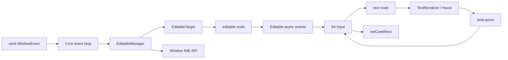

# RFC：Editable 节点与 Input 组件

- **状态**：已接受
- **日期**：2026-07-24
- **作者**：末语项目组
- **适用范围**：`moyu_core`、`moyu_nodes`、`moyu_ops`、`@momoyu-ink/kit`、`@momoyu-ink/gallery`
- **相关 RFC**：[基础节点系统](./2026-07-20-node-system.md)、[布局系统](./2026-07-20-layout-system.md)、[Clip](./2026-07-20-clip.md)
- **相关实现**：`crates/core/src/core/editable.rs`、`crates/core/src/traits/editable_target.rs`、`crates/nodes/src/nodes/editable.rs`、`crates/nodes/src/events/editable.rs`、`crates/nodes/src/nodes/text.rs`、`crates/nodes/src/renderer/text.rs`、`crates/ops/src/focus.rs`、`packages/kit/src/components/input.tsx`、`packages/gallery/src/pages/input.tsx`

## 摘要

本文定义末语单行文本输入的长期语义。引擎以无渲染的 `editable` 节点保存已提交文本、IME 预编辑文本和编辑状态；`EditableManager` 管理窗口内唯一的活动编辑目标、键盘路由、IME 生命周期及候选窗位置；Kit 的 `Input` 组合 editable、Text、Clip、placeholder、背景和 caret，形成可直接使用的输入控件。

当前编辑模型只支持在文本末尾追加字符、提交 IME 文本和按 Unicode grapheme 删除末尾内容。它不包含任意位置 caret、选区、剪贴板、多行、水平滚动或无障碍输入桥。

Editable 专属事件通过节点异步事件通道发送。内建编辑先在 Rust 中同步完成，随后事件进入 Native QuickJS 队列或 Web microtask；全局 KeyboardEvent 仍使用 target ID `0`，不为 editable 建立键盘冒泡路径。

## 背景

末语使用自定义 React reconciler 和 Rust 场景节点，不具备 DOM `<input>`、浏览器 selection 或 textarea IME bridge。文本输入需要同时处理以下问题：

- pointer 命中与窗口内唯一编辑焦点；
- 普通键盘字符、Backspace、Space 和修饰键过滤；
- winit IME preedit、commit、启停与切换时序；
- 节点变换、舞台缩放和 DPI 下的候选窗位置；
- 输入内容必须按纯文本渲染，不能解释 Text markup；
- Rust 状态、生成 bindings 和 Kit 受控/非受控接口之间的一致性；
- readOnly、disabled、hover、press、focused 等交互状态。

这些职责不能全部放入渲染节点，也不应展开为大量分散的 `Core::*` 方法。EditableManager 参考 Graphics 的子系统组织方式，由 Core 组合并拥有完整依赖与状态，但保持同步、常驻且不建立额外线程。

## 目标

本文规定：

- EditableManager、EditableTarget、Editable 节点与 Kit Input 的职责边界；
- 编辑焦点的获取、切换、失效和窗口失焦语义；
- 普通键盘输入、IME preedit/commit 和单行清理规则；
- Editable props、commands、events 与生成 TypeScript 类型；
- Text 纯文本布局和末尾 caret 定位协议；
- Input 的受控/非受控同步、视觉状态、caret 和 pointer 行为；
- IME 候选窗坐标转换与事件循环维护顺序；
- 锁、异步事件和扩展 EditableTarget 时必须遵守的不变量；
- 当前支持范围、验证要求和已知限制。

## 非目标

本文不定义：

- 任意位置插入点、方向键移动、Home/End、鼠标定位或 selection；
- 复制、剪切、粘贴、撤销重做和系统文本菜单；
- 多行输入、自动换行编辑、password 或输入校验规则；
- 长文本水平滚动和 caret 自动保持可见；
- 浏览器 hidden textarea、Android/iOS 原生输入桥或 accessibility；
- DOM input 事件、selection API 或同步 `preventDefault()` 编辑取消语义；
- 通用节点 focus traversal、Tab 顺序、focus scope 或键盘节点冒泡；
- Huozi 任意 source offset、insertion stop、selection geometry 或 layout revision 协议。

这些能力需要独立 RFC 或迭代。

## 术语

### Active target

EditableManager 保存的唯一活动 editable 节点 ID。它独立于 pointer hover target、普通 Focusable 命中和窗口焦点。

### Committed value

已经提交的单行文本，对应 `EditableState.value`。

### Composition

IME 正在预编辑、尚未提交的临时文本。对外表示为 `EditableState.isComposing` 与 `compositionText`。

### Display value

Kit Input 实际交给 Text 渲染的字符串：

$$
\text{displayValue}=\text{value}+\text{compositionText}
$$

### Caret rect

Kit 根据 Text layout 结果写回 editable 的局部矩形。它只用于平台 IME 候选窗定位，不代表 Rust 编辑模型中的任意插入位置。

## 总体架构



职责如下：

| 层 | 职责 |
| --- | --- |
| Core | 组合 EditableManager，并从 pointer、keyboard、window event 和 `about_to_wait` 调用它 |
| EditableManager | active target、焦点切换、键盘/IME 路由、IME 启停、候选窗坐标 |
| EditableTarget | Core 面向可编辑节点的能力接口 |
| `editable` | value、composition、单行编辑、commands 和专属事件 |
| Text / TextRenderer | 纯文本布局、显示和末尾位置事件 |
| Kit `Input` | 组件组合、本地状态、受控同步、样式、caret、placeholder 和 pointer 反馈 |
| Gallery | 手动验证普通输入、IME、焦点、变换、受控值及状态皮肤 |

`editable` 没有 Renderer。它通过 children 测量获得命中尺寸，具体显示完全由 Kit 组合的 Text、Sprite 和 Clip 完成。

## Core 与 EditableManager

### 所有权与依赖

Core 直接持有一个 EditableManager。Manager 当前持有窗口、节点索引、stage 坐标转换信息，以及受互斥锁保护的活动目标和 IME 状态：

```rust
struct EditableManagerState {
    active_target: Option<u32>,
    ime: ImeState,
}
```

具体字段布局、同步原语和 stage transform 表示属于 Core 内部实现，不构成公开兼容接口。Manager 从 `Core::new()` 起常驻，不使用 `ArcSwapOption`、异步初始化或独立线程。Core 当前通过以下 accessor 返回 Manager：

```rust
pub fn editable(&self) -> &EditableManager
```

`EditableManager::focus()` 和 `blur()` 是公开方法，`moyu_ops` 通过该 accessor 调用。Manager 的事件循环方法仅在 Core 模块树内可见。

### EditableTarget

可接收编辑输入的节点实现：

```rust
pub trait EditableTarget: Node {
    fn is_disabled(&self) -> bool;
    fn is_read_only(&self) -> bool;
    fn did_focus(&mut self);
    fn did_blur(&mut self);
    fn handle_keyboard_input(&mut self, event: &KeyEvent, modifiers: ModifiersState);
    fn handle_ime(&mut self, event: &Ime);
    fn settle_pending_clear(&mut self);
    fn cancel_composition(&mut self);
    fn ime_cursor_rect(&self) -> Option<Rect>;
}
```

实现 trait 的节点还必须覆写 `Node::as_editable_target()` 和 `as_editable_target_mut()` 返回自身。Core 根据能力而不是节点类型字符串路由输入。

Editable 同时实现 Focusable，供 hit-test 使用。Focusable 只表示节点可成为 pointer 命中目标，不等价于拥有编辑焦点。

## 焦点语义

### 合法目标

`focus(node_id)` 只接受满足以下条件的节点：

1. 从 root ID `0` 的逻辑树可达；
2. 节点及所有祖先均 `visible=true`；
3. 节点实现 EditableTarget；
4. 节点未 disabled。

readOnly 节点可以获得焦点，但不能编辑，也不会启用 IME。

### 获取与切换

聚焦新的合法目标时，顺序固定为：

1. 清除旧 `active_target`；
2. 旧节点存在时取消 composition；
3. 旧节点发送 blur；
4. 新节点发送 focus；
5. 写入新的 `active_target`。

重复聚焦当前目标直接成功，不重复发送 focus。

当前 focus 事件在新 active ID 写入之前进入异步事件队列；blur 事件入队前旧 active ID 已清除。用户侧事件处理器异步执行，不应依赖在回调中同步读取 Manager 内部状态。

### Pointer 与窗口

鼠标按下和触摸开始在派发 `mousedown` / `touchstart` 之前调用 `handle_pointer_down(target_id)`：

- 命中合法 editable：获得焦点；
- 命中普通节点、disabled editable 或不可见目标：当前 editable 失焦。

Manager 只检查命中节点自身，不向上寻找 editable 祖先。Input 的背景、Text、placeholder、caret 和 Clip 必须 `interactive=false`，保证外层 editable 成为命中目标。

窗口收到 `Focused(false)` 时，Core 先 blur active editable，再派发 target ID `0` 的窗口 Blur 事件。窗口重新获得焦点不会自动恢复 editable 焦点。

### 生命周期失效

`maintain()` 和键盘输入入口都会重新验证 active target。节点 detached、destroyed、disabled、不可见或位于不可见祖先下时，Manager 执行 blur。

NodeMap 中存在节点不代表节点仍在逻辑树；验证必须从 root 遍历，不能只查询 NodeMap。

## 键盘输入

Core 对非 synthetic KeyboardInput 的处理顺序为：

1. Android BrowserBack 特例；
2. 读取当前 modifiers；
3. EditableManager 将事件同步路由给 active target；
4. Core 再派发全局 KeyboardEvent。

全局 KeyboardEvent 的 `target_id` 固定为 `0`，`is_composing` 固定为 `false`。Editable 不建立键盘节点冒泡路径。

Editable 只在 KeyDown、未 disabled 且未 readOnly 时处理编辑：

| 输入 | 行为 |
| --- | --- |
| Backspace | 删除 committed value 末尾一个 Unicode grapheme |
| Space | 满足修饰键规则时追加一个普通空格 |
| `Key::Character` | 使用 `event.text` 追加文本 |
| 其它 NamedKey | 不修改 value |
| KeyUp | 不修改 value |

字符和 Space 的修饰键规则为：

```text
!super && (!control || alt)
```

该规则阻止 Command/Super 和普通 Ctrl 快捷键写入文本，同时保留 Windows/Linux AltGr 常见的 Ctrl+Alt 字符输入。

Rust 内建编辑先于全局 KeyboardEvent 完成。JS `preventDefault()` 不能撤销已经发生的编辑。

## 单行文本状态机

Editable 保存：

```rust
pub struct Editable {
    pub value: String,
    composition: Option<String>,
    pub disabled: bool,
    pub read_only: bool,
    caret_rect: Option<Rect>,
    node_base: NodeBase,
}
```

### 单行清理

props value、`setValue`、普通字符、IME preedit 和 commit 都经过统一单行清理：

- `\r` 和 `\n` 转换为空格；
- 连续 CR/LF 序列只生成一个空格；
- 其它字符原样保留。

### 普通编辑

普通字符插入会先取消已有 composition，再追加到 value。Backspace 同样先取消 composition，再按 Unicode grapheme cluster 删除末尾；空 value 时不发送事件。

### Programmatic value

props value 和 `setValue` command 会清理文本、替换 committed value 并取消 composition，不发送 change。若取消了已有 composition，仍会发送 compositionEnd 和 input。

### Disabled 与 readOnly

| 状态 | 可 focus | 接受键盘编辑 | 启用 IME |
| --- | ---: | ---: | ---: |
| 普通 | 是 | 是 | 是 |
| readOnly | 是 | 否 | 否 |
| disabled | 否 | 否 | 否 |

切换到 disabled 或 readOnly 会取消已有 composition。active target 动态变为 disabled 后，在下一次维护或键盘入口中 blur；readOnly 保留焦点。

## IME

### 平台状态

EditableManager 使用：

```rust
enum ImeState {
    Disabled,
    PendingEnable { target_id: u32 },
    Enabled { target_id: u32 },
}
```

所需 IME 目标必须同时满足：

```text
window.has_focus
&& active target exists
&& !disabled
&& !readOnly
```

### 生命周期转换

| 当前状态 | 所需目标 | 新状态 | Window 调用 |
| --- | --- | --- | --- |
| Disabled | Some(id) | Enabled(id) | `set_ime_allowed(true)` |
| PendingEnable(id) | 同一 id | Enabled(id) | `set_ime_allowed(true)` |
| PendingEnable | None | Disabled | 无 |
| PendingEnable(old) | Some(new) | PendingEnable(new) | 无 |
| Enabled(old) | None | Disabled | `set_ime_allowed(false)` |
| Enabled(old) | Some(new) | PendingEnable(new) | `set_ime_allowed(false)` |
| Enabled(id) | 同一 id | 不变 | 无 |

在两个 editable 间切换时，平台先收到 disable，下一次 event-loop turn 才 enable 新目标，避免同一轮 disable/enable 被平台合并。

`Ime::Enabled` 和 `Ime::Disabled` 是平台生命周期通知，不作为 `set_ime_allowed()` 的确认信号。只有 Manager 状态为 Enabled 且 target 仍等于 active target 时，Preedit 和 Commit 才会路由到节点。

### Preedit 与 commit

事件顺序如下：

| 动作 | Editable 事件顺序 |
| --- | --- |
| 首次非空 preedit | compositionStart → input |
| preedit 变化 | compositionUpdate → input |
| 重复相同 preedit | 无 |
| 非空 commit，原来 composing | compositionEnd → change(insertCompositionText) → input |
| 非空 commit，原来未 composing | change(insertCompositionText) → input |
| 空 commit，原来 composing | compositionEnd → input |
| 空 commit，原来未 composing | 无 |

winit 可能在 Commit 前发送空 Preedit。Editable 将已有 composition 更新为 `Some("")`，先发送 compositionUpdate 和 input。若同一事件批次没有后续 Commit，下一次 `maintain()` 调用 `settle_pending_clear()`，再发送 compositionEnd 和 input。

### 候选窗位置

Kit 把 Text layout 的末尾坐标写成 editable-local caret rect。Manager 将该矩形转换为物理窗口坐标，再调用：

```rust
window.set_ime_cursor_area(position, size)
```

当前坐标实现依次应用 editable 节点的 global transform、stage scale 与平移，以及 window scale factor。该计算顺序是内部实现；对外协议只要求节点变换、stage 变换和 DPI 变化后，候选窗位置与可见 caret 对齐。

`maintain()` 的顺序固定为：

1. 重新验证 active target；
2. 对齐 IME 生命周期；
3. 结算空 preedit；
4. 更新候选窗位置。

## Props、Commands 与 Events

### Editable props

```ts
type EditableProps = {
  value?: string;
  disabled?: boolean;
  readOnly?: boolean;
};
```

Props 使用 Patch 语义：字段缺失保持现值，Set 写入新值，Reset 恢复默认值。

### Editable state

```ts
type EditableState = {
  value: string;
  isComposing: boolean;
  compositionText: string;
};
```

### Editable commands

```ts
type EditableCommand =
  | { subCommand: 'getState' }
  | { subCommand: 'setValue'; value: string }
  | {
      subCommand: 'setCaretRect';
      x: number;
      y: number;
      width: number;
      height: number;
    };
```

- getState 返回当前 EditableState；
- setValue 替换 committed value，不发送 change；
- setCaretRect 只更新平台 IME 使用的局部矩形。

### Editable events

```ts
type EditableChangeSource =
  | 'insertText'
  | 'insertCompositionText'
  | 'deleteBackward';
```

事件包括 focus、blur、input、change、compositionStart、compositionUpdate 和 compositionEnd，均携带完整 EditableState；change 额外携带 source。

Editable 专属事件通过 `NodeEventSource::send_event()` 异步派发：Native 进入 QuickJS VM 队列，Web 进入 microtask。上述“事件顺序”表示入队顺序，不表示 Rust 在持锁期间同步调用 JS。

### Focus bridge

moyu_ops 提供 native 和 web 共用的 focus bridge：

```text
focus_editable(nodeId)
blur_editable(nodeId)
```

Kit 的 `focusEditable()` / `blurEditable()` 使用 `moyu.pushCommand()` 调用它们。当前 bridge 忽略 Manager 返回的 bool，无效 node ID、disabled target 或 blur 非 active target 时，JS 侧不会收到失败结果。

## Text 支撑

### 纯文本布局

TextProps 提供 `parseMarkup?: boolean`，默认 true。TextRenderer 根据该值选择：

- true：Huozi markup layout；
- false：Huozi plain layout。

Input 强制对 value 和 placeholder 使用 `parseMarkup={false}`，用户输入中的 `<...>` 按普通文本显示。

### TextLayoutEvent

Text 在 renderer prepare 阶段实际重新执行布局且布局成功后，异步发送：

```ts
type TextLayoutEvent = {
  text: string;
  width: number;
  height: number;
  endCursorPosition: [number, number];
};
```

Input 只接受 `event.text === current displayValue` 的事件，避免旧文本布局结果覆盖当前 caret。事件只提供完整文本末尾位置，与当前末尾编辑模型一致。

文本内容和排版属性会触发新的 prepare；仅改变 transform、opacity、tint、interactive 或 cursor 等不影响文本布局的节点属性，不会因此重新发送 textLayout。调用方不应把该事件当作任意节点几何变化后的同步通知。

## Kit Input

### 公共 API

```ts
interface InputProps
  extends Omit<MoyuNodeAttributes, 'children' | 'onFocus' | 'onBlur' | 'onInput' | 'onChange'> {
  value?: string;
  defaultValue?: string;
  placeholder?: string;
  disabled?: boolean;
  readOnly?: boolean;
  autoFocus?: boolean;
  width: number;
  height: number;
  paddingX?: number;
  textStyle: Omit<MoyuTextAttributes, 'children' | 'interactive' | 'text'>;
  placeholderStyle?: Omit<MoyuTextAttributes, 'children' | 'interactive' | 'text'>;
  caret: InputCaretStyle;
  background?: InputBackground;
  onInput?: (state: EditableState) => void;
  onChange?: (state: EditableState, source: EditableChangeSource) => void;
  onFocus?: (state: EditableState) => void;
  onBlur?: (state: EditableState) => void;
  onCompositionStart?: (state: EditableState) => void;
  onCompositionUpdate?: (state: EditableState) => void;
  onCompositionEnd?: (state: EditableState) => void;
}

interface InputHandle {
  focus(): void;
  blur(): void;
  getState(): EditableState;
}
```

默认值：

- `defaultValue=''`
- `placeholder=''`
- `disabled=false`
- `readOnly=false`
- `autoFocus=false`
- `paddingX=0`
- `cursor='text'`
- caret blink interval 为 500ms

### 组件结构

```text
editable
├─ background sprite（可选）
└─ clip
   ├─ value text
   ├─ placeholder text（displayValue 为空时）
   └─ caret sprite
```

viewport width/height 会 round 到整数；content width 为 `max(0, width - 2 * paddingX)`。所有显示子节点均 `interactive=false`。

### 受控与非受控

初始值只从首次 render 的 `value ?? defaultValue` 捕获。后续 defaultValue 变化无效。

外部 value 与当前 committed value 不同时，Input 发送 setValue，再立即执行 getState 更新本地状态。用户输入不会被受控 prop 同步阻断：引擎状态和显示先更新，父组件应在 onChange 中回写新 value；若父组件保留旧 value，后续 effect 才回滚。

`InputHandle.getState()` 返回 Kit 本地缓存，不会同步查询引擎。

### Placeholder 与 caret

placeholder 只在 value 和 compositionText 都为空时显示。

文字或 composition 变化会清除旧 caretPosition，并重置闪烁。caret 只有在 focused、当前闪烁阶段可见且已收到匹配的 textLayout 时显示。

caret 固定为零边界 nineslice sprite。高度优先使用 `caret.height`，否则使用 `textStyle.fontSize`，最后回退 viewport height。当前 Input 使用 `endCursorPosition[0]` 作为 x，并把 caret 垂直居中；未消费 endCursorPosition 的 y。

### 背景与交互状态

InputBackground 可为单一样式或：

```ts
interface InputBackgroundStates {
  idle: InputBackgroundStyle;
  hover?: InputBackgroundStyle;
  press?: InputBackgroundStyle;
  focused?: InputBackgroundStyle;
  readOnly?: InputBackgroundStyle;
  disabled?: InputBackgroundStyle;
}
```

优先级固定为：

```text
disabled > readOnly > press > focused > hover > idle
```

缺失状态回退到 idle。

Input 使用 pointer 事件维护 hover/press；press 期间监听全局 mouseup、touchend 和 touchcancel，避免在控件外释放后卡住。调用方 pointer handler 先执行，若调用 `preventDefault()`，Input 的默认状态更新不会执行。

Disabled Input 强制 `interactive=false` 并清理 hover/press。非 disabled 时保留调用方传入的 interactive；cursor 默认 text，可由调用方覆盖。

### AutoFocus

autoFocus 只在首次挂载 effect 中请求焦点。初始 disabled 时忽略；后续改为 enabled 不会自动重新聚焦。多个 Input 同时 autoFocus 时，最后执行 effect 的有效 Input 获得焦点。

## 锁与事件不变量

实现与扩展 EditableTarget 时必须保持：

1. EditableManager 的 state lock 只保护 active target 与 ImeState；
2. 获取 NodeLock、调用节点方法和调用 Window API 前释放 Manager state lock；
3. 焦点切换时不同时持有两个节点写锁；
4. blur 入队前清除旧 active target；
5. pointer focus 在 mousedown/touchstart 入队前完成；
6. 内建键盘编辑在全局 KeyboardEvent 入队前完成；
7. IME Preedit/Commit 只发送给 Enabled 且仍为 active 的目标；
8. active target 校验使用 root 可达性，不能只查 NodeMap；
9. Editable 专属事件使用 NodeEventSource 异步通道，不建立独立同步回调；
10. 输入显示子节点不得截获外层 editable 的 pointer 命中。

## 平台与运行边界

| 平台 | 当前代码边界 | 本 RFC 的验证要求 |
| --- | --- | --- |
| Windows native | winit KeyboardInput、IME、候选窗 API | Microsoft 拼音实机验证 |
| Linux native | 使用同一 winit 路径 | 编译与目标桌面环境 IME 实测分别记录 |
| macOS native | 使用同一 winit 路径 | 编译与系统输入法实测分别记录 |
| Web | 节点、bindings 与 focus bridge 可编译 | 当前没有 hidden textarea 或专用浏览器文本输入 bridge |
| Android/iOS | Core 代码可编译，Android 有 BrowserBack 特例 | 当前没有完整移动端软键盘输入协议 |

不得仅根据共享 winit 代码声称某平台 IME 已完成。运行时支持结论必须来自对应平台和输入法的实际验证。

## Gallery 手动验证

Gallery Input 页面覆盖：

- 非受控 Input、autoFocus、普通输入、Space 和 Backspace；
- Microsoft 拼音及 composition/input/change/focus/blur 日志；
- 多 Input 焦点切换；
- 父容器 scale、rotation 和 translate 下的候选窗位置；
- 受控 value 回写和程序化 value 更新；
- readOnly、disabled 及动态切换；
- idle、hover、press、focused、readOnly、disabled 背景；
- `<纯文本>` 不被 Text markup 解析。

Gallery 是人工验收入口，不代替自动状态机测试或跨平台实机验证。

## 性能

- 普通键盘和 IME 路由只锁定 active 节点；
- active target 重验会从 root 递归遍历可见树，当前在每次 about_to_wait 和键盘输入前执行；
- IME 候选窗位置在每次 maintain 中尝试更新；
- Text 内容或排版属性触发 prepare 后重新 layout，layout 成功时异步发送 textLayout；
- caret 闪烁使用 Kit 定时器，不触发 Rust 文本状态变化。

当前实现优先保证焦点与 detached 节点正确性，没有为 active target 保存祖先链或树 revision。若未来场景树规模使重验成为可测量热点，应先基于 profile 再引入失效索引，不提前增加缓存一致性复杂度。

## 错误与边界行为

- focus 非 editable、disabled、detached 或不可见节点：Manager 返回 false；当前 JS bridge 仍返回成功；
- blur 非 active ID：Manager 返回 false；当前 JS bridge 仍返回成功；
- active 节点在 NodeMap 中缺失：blur 仍视为已清理；
- Editable props 反序列化失败：记录错误并忽略本次专属属性更新；
- getState 返回当前状态；setValue 和 setCaretRect 不返回业务值；
- Backspace 作用于空 value：无事件；
- 重复相同 preedit：无事件；
- Text layout 失败：记录错误，不发送 textLayout，caret 暂不可见；
- 布局结果文本与当前 displayValue 不同：Input 丢弃该 caret 位置。

## 已知实现限制

截至本文日期，当前实现有以下可确认限制：

1. 只能在文本末尾追加和删除，没有任意 caret 与 selection；
2. 长文本只被 Clip 裁切，没有水平滚动，caret 和候选窗可能位于可视区域外；
3. Input 只使用 `endCursorPosition[0]` 并垂直居中 caret，不支持 vertical Text 或复杂多行布局；
4. 受控 value 不是同步输入门控，拒绝回写时可能先显示新值再回滚；
5. focus/blur JS bridge 忽略 Manager 的 bool 结果，调用方无法判断请求是否生效；
6. `executeNodeCommand()` 返回弱类型，Input 对 getState 使用类型断言；
7. autoFocus 只在首次挂载生效；
8. Editable 的 Rust `value`、`disabled`、`read_only` 字段公开，crate 内直接写字段会绕过清理和事件规则；
9. active target 重验递归扫描逻辑树，没有树 revision 快路径；
10. Gallery 覆盖主要场景，但没有独立的 Editable 状态机自动化测试；
11. Web 与移动端没有完整原生文本输入桥。

这些限制描述当前实现，不应扩展为长期兼容承诺。修复时应保持本文定义的公开状态、事件和 command 语义，除非由后续 RFC 取代。

## 被否决的方案

### 让 editable 自己渲染文字和 caret

输入状态、文本排版和控件皮肤具有不同演进节奏。无渲染 editable 可以复用 Text、Clip 与 Sprite，并让框架自行组合视觉，不需要为输入节点建立专用 GPU Renderer。

### 把 IME 与焦点继续展开为 Core 方法

焦点目标、IME phase、候选窗与维护顺序构成一个完整子系统。继续把状态与方法散落在 Core 会扩大 Core 的职责面，也更难保持锁与时序不变量。

### 把 EditableManager 做成 Plugin

编辑焦点必须在 pointer event 派发前同步更新，键盘与 WindowEvent::Ime 也直接位于 Core 输入管线。Plugin 生命周期和 command 模型不适合承担该时序。

### 为 editable 建立键盘节点冒泡

当前全局 KeyboardEvent 已有稳定语义，而内建编辑在 Rust 中同步完成。为单个输入控件引入祖先链和键盘冒泡会增加路径维护，却不能让异步 JS preventDefault 撤销编辑。

### 直接依赖 DOM input

Moyu native 使用 QuickJS 和自定义场景节点，没有 DOM。Web 专用 DOM bridge 也不能替代 native 平台输入模型；若未来增加 hidden textarea，应作为平台适配层接入同一 Editable 状态与事件协议。

### 提前实现完整文本编辑器

任意 caret、selection、滚动、剪贴板和跨平台输入桥会引入 source offset、UTF-16/UTF-8 映射、布局 insertion stops 与系统交互协议。当前视觉小说 UI 只需要单行末尾输入，应先保持可维护的小模型。

## 测试与验收

最低自动检查包括：

```bash
cargo build
yarn generate:bindings
yarn workspace @momoyu-ink/kit build
yarn workspace @momoyu-ink/gallery typecheck
yarn workspace @momoyu-ink/gallery build
```

行为验收至少覆盖：

1. 普通字符、Space、AltGr 和 Backspace；
2. Unicode grapheme 删除；
3. Microsoft 拼音 preedit、commit、取消及事件顺序；
4. 多 Input 点击切换、外部点击、窗口 blur、disabled/readOnly；
5. 程序化 focus/blur 与 value 同步；
6. placeholder、caret 闪烁、纯文本 markup 和背景状态；
7. 节点 transform、stage scale 和 DPI 下的候选窗位置；
8. detached、不可见和 disabled active target 的重验清理。

跨平台验证必须分别记录编译环境、运行平台、输入法和实际结果。Gallery 页面存在不代表全部行为已自动通过。

## 后续工作

后续能力应拆分实施：

- 为 Editable 状态机、焦点切换和 IME phase 增加 Rust 自动化测试；
- 让 focus/blur bridge 返回是否生效，并为 Kit handle 定义结果语义；
- 增加水平滚动和长文本 caret 可见性；
- 设计任意 caret、selection、source offset 与 hit-test geometry；
- 增加剪贴板、撤销重做和系统文本菜单；
- 设计 Web hidden textarea 与移动端软键盘 bridge；
- 收紧 Editable Rust 字段可见性，避免绕过状态机；
- 仅在 profile 证明必要时优化 active target 树重验。

## 结论

末语将文本输入分为四层：

- EditableManager 管理窗口级焦点、键盘、IME 和候选窗；
- EditableTarget 定义 Core 面向编辑节点的能力边界；
- 无渲染 editable 保存单行末尾编辑状态并发送异步事件；
- Kit Input 使用 Text、Clip 与 Sprite 提供可配置视觉和受控/非受控接口。

该设计保持 Core、节点状态、文本渲染和控件外观相互独立，同时为后续完整文本编辑和平台输入 bridge 保留清晰扩展点。本文是当前 Editable/Input 行为与公开协议的兼容性基准。
