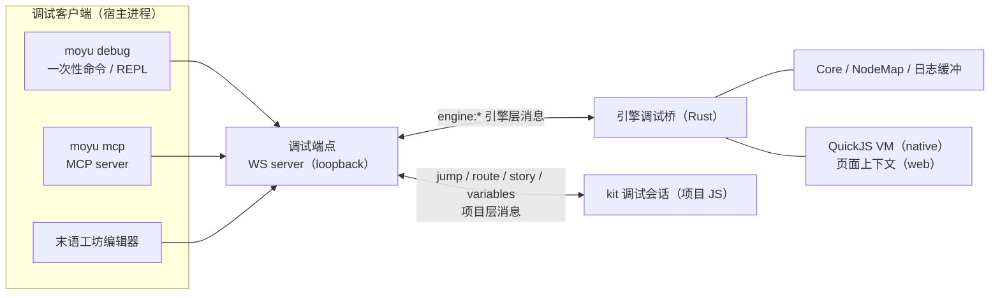

# RFC：运行时调试桥

- **状态**：已接受
- **日期**：2026-09-25
- **作者**：末语项目组
- **适用范围**：`moyu`、`moyu_debugger`、`moyu_core`、`moyu_ops`、`moyu_pal`、`moyu_runtime`、`packages/cli`
- **相关实现**：`crates/debugger/`（引擎侧调试桥：协议、状态快照、节点视图、属性记录、日志缓冲、Logger 包装、截图与两个传输）、`crates/platform/src/logger.rs`（平台日志后端与安装）、`crates/core/src/core/render.rs`（截图回读）、`crates/ops/src/node.rs`（属性转发点）、`packages/cli/src/utils/debug-session.ts`、`packages/cli/src/commands/debug.ts`、`packages/cli/src/commands/mcp.ts`、`packages/cli/src/mcp/`
- **相关 RFC**：[宿主平台抽象](./2026-09-06-host-platform-abstraction.md)、[Moyu JSON Schema 扩展约定](./2026-07-28-json-schema-exchange-protocol.md)

## 摘要

本文为末语引擎增加一个**运行时调试桥**：外部客户端（命令行工具、MCP server、编辑器）可以连接到一个正在运行的引擎实例，读取引擎内部状态、节点树与日志，并在引擎 JavaScript 上下文里求值。

调试桥是**引擎层**能力，由 Rust 侧实现，覆盖 native 与 web 两种平台。它与 kit 现有的**项目层**调试通道（`jump` / `route` / `story:replace` / `variables` 等剧本语义消息）并存，共用同一种传输方式与消息信封，但各自独立连接、互不依赖。

协议只定义两类东西：一条出站 WebSocket 连接（运行时连向宿主），以及一组 `engine:*` 消息。宿主（提供调试端点的进程）可以是 `moyu` 命令行工具、MCP server，也可以是末语工坊编辑器。

## 背景

### 现状

引擎目前没有任何对外观察或控制面。调试只能依赖：

- 终端日志（`moyu_pal::logger` 直接初始化 `env_logger` / `android_logger` / `console_log`，无内存缓冲、无文件输出、无可插拔 hook）；
- web 模式下用浏览器开发者工具看页面；
- 项目自己在 JS 层打印信息。

kit 已经有一套**项目层**调试通道，工作方式是：

- 运行时读取 `params` 里的 `debug` / `debugSessionId` / `debugWsUrl`；
- 运行时作为 WebSocket 客户端连向宿主的 `/debug/ws` 端点；
- 编辑器发往运行时的消息：`session:init`、`jump:request`、`route:request`、`story:replace`、`ui:replace`；
- 运行时发往编辑器的消息：`marker:enter`、`jump:done|error`、`route:done|error`、`story:replace:done|error`、`variables:snapshot|changed`；
- 宿主侧由末语工坊的 `run_preview` 起一个 WS server，编辑器以 `role=editor` 连接。

这条通道只覆盖**剧本与框架语义**，看不到引擎事实：节点树、节点属性、资源、渲染、VM 状态、引擎日志。native 模式下完全不可观察。

### 可复用的现成能力

- **全局访问点**：`get_core()` 提供 `node_map()` 与 `root_node()`；节点 ID 由 `NodeBase::new()` 全局递增分配。
- **树遍历**：`NodeBase::children()`、`crates/core/src/utils/walk.rs` 的 `walk_nodes_enter_leave*`。
- **跨线程投递到 VM**：`QuickVM::on_vm_thread()` 把闭包推入 async task 队列并触发唤醒；唤醒 hook 经 winit event proxy 发出 `ApplicationInitEvent::VmWake`，主线程随后执行 `vm.tick()`。
- **JS 求值**：`__moyu_eval`（`crates/runtime/src/ops/eval.rs`）已经在 VM 上下文中执行任意 JS 代码。
- **节点属性入参**：`ops::node::create_instance` / `ops::node::update_props` 拿到的 `props` 是一个 JS 对象，可用 `from_js::<serde_json::Value>()` 通用地转成 JSON。
- **出站 WebSocket 客户端**：native 侧 `moyu_runtime` 已用 `tokio-tungstenite` 实现 `WebSocket` polyfill（`__moyu_ws_connect` / `__moyu_ws_send` / `__moyu_ws_close`），可作为调试连接的基础。
- **参数注入**：native 走命令行 `--params <string>`，web 走 `window.__moyu_params`，最终都汇入 `MoyuConfig::params`。

### 现状不足

- 引擎没有监听任何端口，也没有出站调试连接；
- 引擎日志没有环形缓冲，无法回溯最近若干条；
- 节点属性没有统一的读出口（属性被各节点写进自己的结构体字段）；
- 没有结构化的节点树导出。

## 目标

本文规定：

- 调试桥的传输方式、连接方向与端点发现方式；
- 消息信封、命名空间划分与请求/响应/推送约定；
- 引擎层能力集合与每条消息的字段定义；
- 调试桥在 native 与 web 上的执行模型与线程规则；
- 调试开关与安全边界；
- 命令行工具与 MCP server 的形态与职责；
- 分阶段实施顺序与每阶段验收标准。

## 非目标

本文不定义：

- 修改或替换 kit 现有的项目层调试通道（`jump` / `route` / `variables` 等）；
- 远程调试（调试桥只监听/连接 loopback）；
- 面向发布构建的调试能力（调试桥以参数开关为准，不按构建类型区分）；
- 热重载、时间旅行调试、性能剖析采样等高级调试功能；
- 编辑器侧的调试界面设计（由末语工坊自行决定是否接入）；
- 节点属性的完整 schema 导出（`commands.schema.json` / `ui.schema.json` 的职责不在这里）；
- 独立进程或独立端口提供调试能力之外的新运行时形态。

## 术语

### 运行时（runtime）

被调试的进程或页面：native 是引擎可执行文件，web 是加载了引擎 wasm 的浏览器页面。

### 客户端（client）

使用调试能力的工具：`moyu debug` 命令行、`moyu mcp`（MCP server）、末语工坊编辑器。客户端通常同时充当自己的宿主（自己监听调试端点）；也可以只作为客户端连到别人开的宿主上。

### 宿主（host）

提供调试端点（WebSocket server）的进程，例如 `moyu` 命令行工具、MCP server 或末语工坊。宿主负责监听 loopback 端口，运行时连入。

### 引擎层消息

描述引擎事实的消息，命名空间为 `engine:`：节点树、节点属性、日志、求值、引擎状态。

### 项目层消息

描述剧本与框架语义的消息，即 kit 已有消息集：`session:`、`marker:`、`jump:`、`route:`、`story:`、`ui:`、`variables:`。不在本文管辖范围，但共用同一端点与信封格式。

### 属性记录

调试桥在属性经过 JS 边界时留存的副本，按节点 id 存于桥自己的旁表，用于 `engine:props` 读取。节点自身只保存解析后的字段，不含调试状态。

## 总体架构



两条通道互相独立：引擎调试桥不依赖项目是否加载、是否使用 kit；项目层通道继续按现状工作。宿主可以只接受其中一条连接的接入。

## 传输与连接

### 连接方向

运行时始终作为**客户端出站连接**宿主。原因：

- web 平台的运行时是浏览器页面，无法监听端口；
- 宿主的形态本来就多样（命令行、MCP、编辑器），由宿主决定端口更自然；
- 与该能力已有的实现方式（kit 项目层通道、末语工坊预览）一致。

native 侧复用 `moyu_runtime` 已有的 tokio WebSocket 客户端能力，不引入 HTTP server 依赖。

### 端点

```text
ws://127.0.0.1:<port>/debug/ws?sessionId=<id>&role=engine
```

- `role` 区分连接身份：`engine`（引擎层）、`runtime`（项目层）、`editor`（编辑器）。
- `sessionId` 与现有项目层通道保持一致，宿主可据此把一个运行时上的两条连接关联起来。附加模式下可以缺省，由运行时自行生成并在 `engine:hello` 中带出。
- 端点只允许 loopback 地址。

### 参数注入

调试端点通过宿主提供的参数传入运行时，**参数存在即启用，不存在则完全不启用**。键名与项目层调试键（`debug` / `debugWsUrl` / `debugSessionId`）区分开，两者可同时存在，互不干扰。

- **native**：宿主用 `--params '<json>'` 启动引擎，引擎在初始化阶段读取 `MoyuConfig::params`：

  ```jsonc
  {
    "engineDebugWsUrl": "ws://127.0.0.1:6321/debug/ws?sessionId=abc&role=engine",
    "engineDebugSessionId": "abc"
  }
  ```

- **native 附加场景**：手动启动的引擎（框架脚本、打包成品）没有宿主帮它注入 `params`，此时引擎额外读环境变量 `MOYU_ENGINE_DEBUG_WS` 作为后备，`params.engineDebugWsUrl` 优先。

- **web**：宿主把参数放在页面地址的 query 上，引擎从 `location.search` 读取：

  ```text
  http://localhost:8000/
    ?engineDebugWsUrl=ws%3A%2F%2F127.0.0.1%3A6321%2Fdebug%2Fws%3FsessionId%3Dabc%26role%3Dengine
    &engineDebugSessionId=abc
  ```

  宿主不需要改写 HTML 或 `index.json`，手动调试时在地址栏加参数也能生效。入口页固定加载同目录下的 `index.json`（不再从 `?entry=` 读取），因此调试参数与入口文件互不影响。

两种平台都在项目脚本加载之前完成读取，因此调试桥不依赖项目是否使用 kit。

### 连接生命周期

- 连接失败或断开时静默重试（间隔 1s，最多持续到引擎退出），不阻塞启动、不打印用户可见错误，只在 `warn` 级别记录一次。
- 宿主未启动时调试桥不产生任何副作用。

## 消息约定

### 信封

所有消息都是单个 JSON 文本帧：

```ts
interface DebugEnvelope {
  type: string;
  sessionId: string;
  /** Present on requests and on the responses that answer them. */
  requestId?: number;
}
```

- 请求：`requestId` 必填，由宿主分配并保证在会话内唯一。
- 响应：`requestId` 原样带回。
- 推送：不带 `requestId`。

### 命名与响应约定

- 请求类型为 `<namespace>:<action>`，例如 `engine:tree`。
- 成功响应为 `<request type>:done`，携带结果字段。
- 失败响应为 `<request type>:error`。
- 推送类型为 `<namespace>:<event>`，例如 `engine:log`。

该约定与 kit 现有通道（`jump:done` / `jump:error` / `marker:enter`）一致。

### 错误

```ts
interface DebugError {
  requestId: number;
  code?: 'not_supported' | 'not_found' | 'timeout' | 'invalid_request' | 'internal';
  message: string;
  stack?: string;
}
```

被求值片段自身抛出的异常不携带 `code`：它是求值的正常结果，用来区分于调试桥自身的失败。

## 引擎层能力

以下为引擎层消息的完整定义。实现按阶段推进（见"分阶段实施"），未实现的能力不进入 `engine:hello` 的 `capabilities`，属于该能力的响应字段也一并缺省。

### `engine:hello`（推送）

连接建立后运行时立即发送，用于让客户端确认这是引擎层连接，并知道对方是谁、支持什么。

```ts
interface EngineHelloMessage {
  type: 'engine:hello';
  sessionId: string;
  platform: 'windows' | 'macos' | 'linux' | 'android' | 'ios' | 'web';
  engineVersion: string;
  entry: string;
  capabilities: EngineDebugCapability[];
  /** Whether the engine has finished starting up. See `engine:ready`. */
  ready: boolean;
}

type EngineDebugCapability = 'state' | 'eval' | 'logs' | 'tree' | 'props' | 'screenshot';
```

### `engine:ready`（推送）

引擎启动完成后推送一次，让早已连上的客户端知道启动已完成。

```ts
interface EngineReadyMessage {
  type: 'engine:ready';
  sessionId: string;
}
```

“启动完成”指项目脚本已经跑完、窗口已可见且已请求首帧。启动画面是纯展示，不会让这个状态推迟。

客户端拿到 `ready: false` 时的行为由客户端自己决定，协议只要求：需要已启动运行时的命令（`engine:eval`）应在收到 ready 之后再发；拉日志与查看启动过程不等待。

### `engine:state`

读取引擎的静态与运行状态，用于快速确认"我现在连的是哪个实例、跑到哪一步了"。

```ts
// request
interface EngineStateRequest { type: 'engine:state'; sessionId: string; requestId: number }

// response payload
interface EngineStateSnapshot {
  /** Entry file the engine was started with, as given on the command line or page query. */
  entry: string;
  platform: 'windows' | 'macos' | 'linux' | 'android' | 'ios' | 'web';
  engineVersion: string;
  /** Logical size and device pixel ratio of the rendering surface. */
  surfaceSize: { width: number; height: number; scaleFactor: number };
  nodeCount: number;
  /** Milliseconds since the bridge started. */
  uptimeMs: number;
  /** Whether the engine has finished starting up. */
  ready: boolean;
  /** Present once the `logs` capability exists. */
  logs?: { buffered: number; dropped: number };
}
```

统计字段只包含便宜可得的值：surface 尺寸与缩放比、节点总数、已运行时长、日志缓冲状况。逐帧统计（累计帧数、每帧参与渲染的节点数）需要在渲染路径上插桩，等出现实际排查需求时再单独讨论。

### `engine:eval`

在运行时的 JavaScript 上下文里执行代码，返回 JSON 化的结果。这是调试桥的通用能力：任何没有专门消息的状态都可以通过它取到。

```ts
// request
interface EngineEvalRequest {
  type: 'engine:eval';
  sessionId: string;
  requestId: number;
  code: string;
  /** Milliseconds; defaults to 5000. */
  timeoutMs?: number;
}

// response payload
interface EngineEvalResult {
  /** JSON-serializable value; omitted when the result cannot be serialized. */
  value?: unknown;
  /** Display form, e.g. 'undefined', '42', '[object Object]', 'function'. */
  repr: string;
  /** True when the value was left out because it exceeded the size limit. */
  truncated: boolean;
}
```

语义：

- 求值就是把片段交给运行时自己的求值入口：native 是 `Context::eval`，web 是页面上的 `eval`。引擎不包装、不改写片段。
- native：在 QuickJS 上下文中求值。多次调用共享同一全局作用域；需要跨调用可见的调试变量应显式挂到 `globalThis`。
- web：在页面上下文中求值。模块顶层作用域内的变量不可见，只能访问 `globalThis` 上存在的对象；因此项目与框架在调试模式下把关心的对象暴露到 `globalThis` 是必要的配套做法。
- 片段内以 `{` 开头的对象字面量会被当作语句块，对象字面量需要加括号。
- 返回值按 JSON 序列化后回传，无法序列化（循环引用等）或没有 JSON 形式（`undefined` / 函数 / symbol）时只返回 `repr`。超过大小上限（256 KB）时只置 `truncated` 并省略 `value`。
- 片段抛错时返回 `engine:eval:error`，带 `message`，不带 `code`。native 上运行时会先把异常转成字符串，因此只有 `message`；web 上能读到异常对象的 `stack`，会一并回传。
- 求值只在引擎启动完成后才有意义，客户端应先等 `engine:ready`。
- native 上等待求值超过 `timeoutMs` 时返回带 `timeout` 的 `engine:eval:error`。web 的页面运行在主线程上，超时不能中断已开始的片段，该限制只在 native 上生效。

### `engine:logs`

拉取引擎日志环形缓冲，并可订阅后续日志。

```ts
// request
interface EngineLogsRequest {
  type: 'engine:logs';
  sessionId: string;
  requestId: number;
  /** Return entries with seq > sinceSeq. */
  sinceSeq?: number;
  level?: 'error' | 'warn' | 'info' | 'debug' | 'trace';
  limit?: number;
  /** When true, subscribe this connection to engine:log pushes. */
  subscribe?: boolean;
}

// response payload
interface EngineLogsResult {
  entries: EngineLogEntry[];
  /** Pass this back as sinceSeq on the next call. */
  nextSeq: number;
  dropped: number;
}
interface EngineLogEntry {
  seq: number;
  level: 'error' | 'warn' | 'info' | 'debug' | 'trace';
  target: string;
  message: string;
  timestampMs: number;
}

// push
interface EngineLogPushMessage {
  type: 'engine:log';
  sessionId: string;
  entry: EngineLogEntry;
}
```

实现方式：平台日志的初始化保持原样（在 `moyu_pal::logger` 里选后端、设级别、安装），只是安装前会把后端穿过一个包装函数交给调试桥的 `create_logger`。包装在不改变原有行为的前提下转发每条记录并写入环形缓冲（固定 2000 条，超出丢弃最旧并累加 `dropped`）；包装虽然常驻，但只有调试桥启动后才真的保留记录，所以未启用时的代价仅是一次原子读，也不为日志做额外格式化。

引擎不写日志文件。持久化由宿主负责：native 的引擎 stdout 本就在宿主手上，web 的浏览器 console 也能通过 `engine:log` 订阅拿到，宿主如需落盘（例如客户端的 `--log-file`）自行处理。

**缓冲与推送的分工**：

- 缓冲是事实来源。连接建立之前的日志（启动阶段）、断线期间产生的日志，都只能从这里取；`sinceSeq` 让客户端在重连后连续续读，不会遗漏。容量内不丢，超出部分用 `dropped` 如实报告。
- 推送只服务于「跟随时实时看到新日志」，因此**允许重复、允许丢弃**。日志缓冲已有按序号的整体视图，客户端一律用 `seq` 收敛：
  - 新条目 `seq` 不大于已打印的最大 `seq` 时丢弃（订阅发生在取快照之前，因此同一条可能既被推送、也在快照里）。
  - `seq` 出现跳号时说明推送被丢过，用 `sinceSeq` 重新拉取即可补上，不需要额外协议。
- 引擎侧对这两条路径区别对待：响应走不丢消息的路径，推送队列有上限，超出即丢弃，避免慢客户端把引擎内存撑大。

### `engine:tree`

按需读取节点树的一层，避免一次拉全树。

```ts
// request
interface EngineTreeRequest {
  type: 'engine:tree';
  sessionId: string;
  requestId: number;
  /** Node to start from; defaults to the root node. */
  nodeId?: number;
  /**
   * Levels of children to include. Defaults to 1.
   * Set to 0 for the node alone, or higher to read a whole subtree in one call.
   */
  depth?: number;
}

// response payload
interface EngineTreeResult {
  node: EngineNodeSnapshot;
}

interface EngineNodeSnapshot {
  id: number;
  /** `Node::node_type()`. */
  type: string;
  label: string;
  visible: boolean;
  /** One level deeper than the node it belongs to, as far as `depth` allows. */
  children: EngineNodeSnapshot[];
}
```

默认只返回一层：客户端先取 root，再按 `id` 逐层展开，这是控制 payload 大小的主要手段。需要一次拿到整棵树的客户端（如命令行工具打印节点树）显式要求更大的 `depth`。

### `engine:props`

读取单个节点的属性。

```ts
// request
interface EnginePropsRequest {
  type: 'engine:props';
  sessionId: string;
  requestId: number;
  nodeId: number;
}

// response payload
interface EnginePropsResult {
  node: {
    id: number;
    type: string;
    /** Last property object received from JS; absent when none was recorded. */
    props?: Record<string, unknown>;
    /** Values the engine computed, as opposed to the ones JS passed in. */
    derived: {
      visible: boolean;
      opacity: number;
      globalOpacity: number;
      interactive: boolean;
      zIndex: number;
      position: Point;
      scale: Point;
      rotation: number;
      skew: Point;
      size: Size;
      intrinsicSize: Size;
      bounds: Record<string, number>;
    };
  };
}
```

`props` 取自调试桥自己维护的旁表：属性对象只在 JS 边界上短期存在（节点最终只保存解析后的字段），所以 `moyu_ops` 提供一个转发点（`set_props_hook`），把每个节点收到的属性对象交给注册的接收方，而**存储与全部逻辑都在调试桥内**（`crates/debugger/src/props.rs`），键为节点 id。

两点取舍：

- 属性以补丁形式到达引擎，所以记录会把每次收到的对象合并累积。这样“创建时设了 `src`、后续只改 `x`”仍能看到 `src`。
- 节点销毁不会通知外部，所以记录在客户端读取节点信息时按需清理（删除已不存在的节点）。

记录在桥启动时开始，而桥启动早于项目脚本，因此启动期创建的节点也能读到。`derived` 由引擎统一从 `NodeBase` 已有的变换与布局字段生成，包含位置、缩放、旋转、倾斜、布局尺寸、固有尺寸、局部包围盒、不透明度（含与父级相乘后的值）、可见性、是否响应输入、绘制顺序。个别节点将来如需导出更丰富的自身状态，可在此基础上单独扩展，不影响上述取值路径。

### `engine:screenshot`

```ts
// request
interface EngineScreenshotRequest {
  type: 'engine:screenshot';
  sessionId: string;
  requestId: number;
  /** Largest width to return; only takes effect together with `maxHeight`. */
  maxWidth?: number;
  /** Largest height to return; only takes effect together with `maxWidth`. */
  maxHeight?: number;
  /** Defaults to true, so a scaled capture keeps the stage proportions. */
  keepAspectRatio?: boolean;
}

// response payload
interface EngineScreenshotResult {
  /** Always `webp`: the engine encodes screenshots in that format. */
  format: 'webp';
  width: number;
  height: number;
  /** The image file, base64 encoded. */
  data: string;
}
```

实现复用引擎已有的快照路径（`Graphics::request_snapshot` → 渲染时把 surface 拷入缓冲区 → 回读 → `Snapshot::save_to_buffer` 编码为 WebP），native 与 web 走同一条路径，不需要为页面单独做 canvas 读取。

拷贝发生在渲染时，所以截图需要引擎至少渲染一帧；暂停的引擎会得到超时错误。

## 执行模型与线程

### native

- 引擎主线程运行 winit 事件循环；`Core`、`NodeMap`、渲染状态都在主线程；VM tick 在 `RedrawRequested` 中执行。
- 调试连接的网络收发在工作线程（tokio task）进行，不阻塞主线程。
- **只读访问**（`engine:state`、`engine:tree`、`engine:props`）可直接在工作线程读 `node_map()`：节点类型要求 `Send + Sync`，`NodeMap` 与节点由 `parking_lot::RwLock` 保护。
- **求值**（`engine:eval`）必须投递到 VM 线程：复用 `QuickVM::on_vm_thread()`，由唤醒 hook 触发 `VmWake`，在 `vm.tick()` 中执行，再经通道把结果回送给工作线程。
- 日志缓冲由 `log::Log` 实现直接写入，读取端加锁取快照。
- 属性记录发生在属性被应用的地方（VM 线程），与读取分开：写入加锁，读取时取一份副本。

### web

- 运行时是页面，调试连接就是页面里的 `WebSocket`；`engine:eval` 直接在页面上下文执行。
- 调试桥（`moyu_debugger`）与其在 `moyu_core` / `moyu_ops` / `moyu_pal` 上的挂点都要能在 wasm 目标下编译：网络与求值走 wasm 侧路径，不依赖 `moyu_runtime`。

## 开关与安全边界

- 调试桥只在显式传入 `engineDebugWsUrl` 时启用；未传入时不存在任何连接、缓冲与额外开销，默认关闭。
- 该能力编译进所有构建（包括 `moyu run` 与编辑器预览使用的 release 引擎）；安全由默认关闭、仅 loopback、显式参数三者保证。
- 端点仅使用 loopback 地址；调试桥不提供对外监听。
- `engine:eval` 等价于任意代码执行：它只在调试桥启用时注册。
- 连接失败、断线不影响运行时行为，不产生用户可见提示。

## 客户端形态

### 命令行：`moyu debug`

面向人与脚本：结果写 stdout（可直接管道），进度与错误写 stderr。

```bash
moyu debug state
moyu debug logs --level warn --limit 50 --follow
moyu debug eval "globalThis.__gameState"
moyu debug tree --depth 8
moyu debug props 12
moyu debug screenshot shot.webp --max-width 1280 --max-height 720
moyu debug state --attach --listen 6321   # 等手动启动的引擎连入
```

每个子命令都是一次完整会话：先监听调试端点，再启动引擎，问一个问题，然后收尾。`--attach` 换成只监听固定端口，等待别人启动的引擎连入，并打印它需要设置的环境变量；这是检查打包成品的途径。

### MCP server：`moyu mcp`

MCP server 是宿主的另一种形态：对上层工具暴露一组工具，调用方直接传参数，不需要拼接命令行字符串。它在 stdio 上按换行分隔的 JSON-RPC 2.0 通信，**stdout 只写协议帧**，所有诊断写 stderr。

| 工具 | 对应消息 | 说明 |
| --- | --- | --- |
| `debug_start` | — | 启动引擎并等它就绪；启动新会话会停掉上一个。附加模式（`attach`）只监听端口、返回环境变量，不启动也不等待引擎 |
| `debug_stop` | — | 停止会话启动的引擎与监听 |
| `debug_state` | `engine:state` | 引擎状态快照 |
| `debug_logs` | `engine:logs` | 读取日志，可用 `nextSeq` 续读 |
| `debug_eval` | `engine:eval` | 在运行时求值 |
| `debug_tree` | `engine:tree` | 读取节点树 |
| `debug_props` | `engine:props` | 读取节点属性与派生值 |
| `debug_screenshot` | `engine:screenshot` | 截图，以图像形式返回 |

会话在工具调用之间保持存活，因此可以启动一次引擎、反复查询。除 `debug_start` 与 `debug_stop` 外，工具在发请求前会等待引擎启动完成。

MCP 的价值在于：工具参数是结构化 JSON（避免命令行转义问题）、一次交互可以调用多个工具、结果可携带结构化数据与图像。它与命令行共用同一套协议、会话与实现。

### 编辑器

末语工坊已经以自己的方式接入项目层通道。引擎层通道是否接入、以什么形式呈现，由编辑器决定，不在本文范围。

## 分阶段实施

### M0：连接骨架（0.5～1 天）

- 引擎侧：`crates/debugger/` 新 crate（协议、状态快照、native 与 web 两个传输）。
- 宿主侧：`moyu debug state`，启动调试端点与引擎，收到 hello 后请求 `engine:state` 并打印 JSON。
- 验收：native 与 web 两种模式下都能连上并打印引擎状态。

实施结果：已完成。native（`--params` 注入）与 web（页面 query 注入）均能连上并返回完整状态快照；宿主侧新增 `packages/cli/src/commands/debug.ts`，并从 `run` 中抽出 `packages/cli/src/utils/static-server.ts` 供两者共用。

已知现象（既有实现，与调试桥无关）：页面连续调用两次 `moyu_init` 时，`console_log` 重复初始化会 panic。

### M1：求值与日志（2～3 天）

- `engine:eval`（native 投递到 VM 线程，web 直接执行）。
- `engine:logs`（环形缓冲 + 订阅推送）。
- 命令行 `moyu debug eval|logs|state` 完整可用。

实施结果：已完成。环形缓冲与平台日志的包装层都归调试桥（后归独立 crate，见 D17），`moyu_pal` 仍是唯一构建与安装日志后端的地方；native 的求值经 `on_vm_thread` 投递到 VM 线程，日志推送与请求响应共用同一条出站通道，断线时清空订阅。命令行新增 `eval` 与 `logs`（含 `--level` / `--limit` / `--since` / `--follow`），`state` 额外报告日志缓冲状况。

实现中的三处协议细化：

- 求值不再使用包装脚本，直接交给运行时自己的求值入口（见下文 D12）；异常与不可序列化结果的处理因此改为在 Rust 侧完成。
- 引擎启动完成通过 `engine:ready` 告知客户端（见 D13），需要已启动运行时的命令在收到 ready 后再发。
- 日志的缓冲与推送分工、以及按 `seq` 收敛的规则见 `engine:logs` 一节（D14）。
- 片段抛错不带 `code`，见"错误"一节。

### M2：节点树与属性（2～3 天）

- `engine:tree`（逐层读取）。
- `engine:props`（属性记录 + `derived`）。
- 验收：能在运行中的游戏里查看任意节点的类型、层级与最近设置的属性。

实施结果：已完成。引擎侧新增节点视图与属性旁表（现为 `crates/debugger/src/nodes.rs` 与 `props.rs`）；`moyu_ops::node` 增加一个属性转发点（`set_props_hook`），引擎自身的数据结构不做任何改动；命令行新增 `tree`（缩进列表，`--depth` 默认 8）与 `props`（JSON）。两者都从节点映射直接读取，不需要渲染线程。

### M3：截图、MCP 与附加模式（2～3 天）

- `engine:screenshot`（web 先行，native 视工作量决定）。
- `moyu mcp`：把上述能力包装为 MCP 工具。
- 附加模式：固定默认端口的 `moyu debug attach`，以及 native 侧的环境变量后备读取。

整体约 1.5～2 周。

实施结果：已完成。截图复用引擎已有的快照路径（渲染时把 surface 拷入缓冲区再回读），native 与 web 同一条路径，编码为 WebP 后以 base64 返回。命令行新增 `screenshot`（`--max-width` / `--max-height` 缩放）。MCP 按 stdio 的 JSON-RPC 实现于 `packages/cli/src/mcp/`，不引入依赖；会话与工具实现共用在 `packages/cli/src/utils/debug-session.ts`，命令行与 MCP 走同一条会话路径。附加模式实现为 `--attach` / `--listen`，只监听固定端口并打印引擎需要设置的环境变量。

## 决策记录

| 编号 | 决策 | 日期 |
| --- | --- | --- |
| D1 | native 与 web 统一采用「运行时出站连接宿主」；宿主决定端口，并在启动时通过 `params` 把端点注入运行时。 | 2026-09-25 |
| D2 | 引擎层与项目层各自独立连接，用 `role` 区分；`moyu debug` 与 MCP 客户端同时连接两条 role，对外只暴露一套命令。 | 2026-09-25 |
| D3 | web 平台的调试端点通过页面地址的 URL query 传给运行时，引擎从 `location.search` 读取；宿主不改写 HTML 或 `index.json`。 | 2026-09-25 |
| D4 | 调试桥以 `engineDebugWsUrl` 出现与否作为唯一开关，不另设命令行开关，也不使用编译期 feature gate。 | 2026-09-25 |
| D5 | `engine:props` 的属性由调试桥自持旁表记录（`moyu_ops` 只提供一个属性转发点），引擎数据结构不含调试状态。 | 2026-09-25 |
| D6 | 引擎日志只保留环形缓冲，不写文件；持久化由宿主持有（native stdout / web 的 `engine:log` 订阅）。 | 2026-09-25 |
| D7 | 本文只定义观察类能力（state / eval / logs / tree / props / screenshot）；控制类消息（重载、重绘、暂停单步、输入注入）不在本文范围，必要时另开 RFC。 | 2026-09-25 |
| D8 | 客户端既能自己启动引擎（M0 起），也能附加到手动启动的实例（固定默认端口，后置到 M3）；后者是调试打包成品的唯一途径。 | 2026-09-25 |
| D9 | native 除 `params.engineDebugWsUrl` 外，额外读环境变量 `MOYU_ENGINE_DEBUG_WS` 作为后备（`params` 优先），供框架脚本与打包成品手动启动时使用。 | 2026-09-25 |
| D10 | 调试桥在 Core 创建后启动，不注册为 Core 插件。模块位置见 D17。 | 2026-09-25 |
| D11 | `engine:state` 只报告便宜可得的值（entry、platform、版本、surface 尺寸与缩放比、节点总数、已运行时长），不做逐帧插桩。 | 2026-09-25 |
| D12 | 求值直接交给运行时自己的求值入口，不包装、不改写片段；结果的显示形式与 JSON 形式由引擎侧转换。 | 2026-09-25 |
| D13 | 引擎启动完成推送一次 `engine:ready`（同时在 `engine:hello` 与 `engine:state` 中带上 `ready`）；只有一个就绪状态，不按能力分类。 | 2026-09-25 |
| D14 | 日志采用「环形缓冲 + 游标拉取」为事实来源、推送作为跟随加速；推送允许重复与丢弃，客户端一律用 `seq` 收敛。响应走不丢消息的路径，推送队列有上限。 | 2026-09-25 |
| D15 | MCP 实现为现有 `moyu` 包的 `mcp` 子命令，协议层单独成模块；不拆新包，也不引入官方 SDK。理由是 MCP 工具需要的能力与命令行完全相同，仅有入口差异。 | 2026-09-28 |
| D16 | 命令结果写 stdout，进度与诊断写 stderr。命令行因此可管道，MCP 的 stdout 自然只含协议帧；引擎子进程的 stdout 转发到 stderr。 | 2026-09-28 |
| D17 | 调试桥收拢为独立 crate `moyu_debugger`（`crates/debugger/`），`moyu` 只调用它的 `create_logger` / `start` / `mark_ready`。日志缓冲与平台日志的包装层随之迁移；`moyu_pal` 仍负责选后端与安装日志，只是安装前把后端穿过调用方传入的包装函数，`moyu_ops` 只保留一个属性钩子。两边都不反向依赖调试桥，依赖方向不发生反转。 | 2026-09-29 |
| D18 | MCP 的 `debug_start` 透出命令行已有的附加模式（`attach` / `listen` 参数）：只监听端口并立即返回 `MOYU_ENGINE_DEBUG_WS`，不启动也不等待引擎；本地构建与打包成品的调试由此在 MCP 层可用。 | 2026-10-02 |

本文待决策问题已全部确认，未决问题为空。

## 替代方案

- **只用现有项目层通道**：需要引擎内部信息时必须改动项目 JS，native 下仍然看不到节点树与属性，且调试能力随项目实现而变。
- **只做 web 版调试**：native 是主要运行形态，web 专用调试的价值有限。
- **日志写文件 + 人工查看**：无控制能力、无交互，读取新数据要重启或等待日志写入磁盘，不适合作为调试接口。
- **直接用 Rust 调试器（gdb/lldb）**：只适用于开发引擎自身，无法用于"项目跑起来之后看它怎么了"这类场景，也不适用于 web。

## 影响面与风险

- **安全**：`engine:eval` 是任意代码执行能力，必须与调试开关、loopback 绑定，且不出现在 release 默认路径。
- **性能**：调试桥启用时，属性更新会在转发点上多一次 JSON 序列化，并为每个节点保留一份属性记录（`props.rs`）；日志缓冲多一份拷贝。桥未启用时这些开销都不存在。
- **一致性**：引擎层与项目层两套通道需要清晰的边界说明，否则容易演化为两个功能重叠的调试面。边界为：引擎层描述引擎事实，项目层描述剧本与框架语义。
- **范围蔓延**：调试桥容易演化成通用远程控制接口。本文明确排除远程调试、热重载与性能剖析，后续如需扩展应另开 RFC。

## 参考

- [RFC：宿主平台抽象](./2026-09-06-host-platform-abstraction.md)
- [RFC：Moyu JSON Schema 扩展约定](./2026-07-28-json-schema-exchange-protocol.md)
- 客户端实现：`packages/cli/src/utils/debug-session.ts`（会话）、`packages/cli/src/commands/debug.ts`（子命令）、`packages/cli/src/mcp/`（MCP 协议与工具）
- 用户文档：`packages/cli/README.md`
- kit 项目层调试通道：`packages/kit/src/debug/runtime.ts`、`packages/kit/src/debug/session.ts`、`packages/kit/src/debug/variableMonitor.ts`
- 末语工坊调试协议：`fishflow/src/services/debugProtocol.ts`
